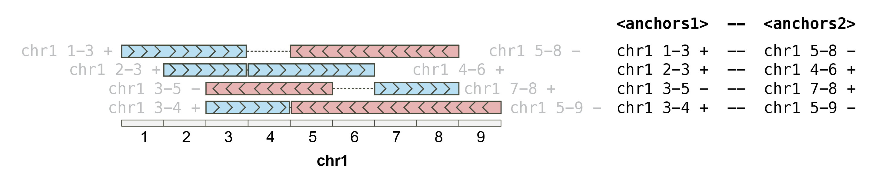
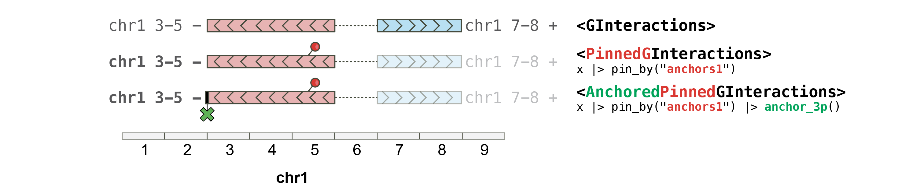
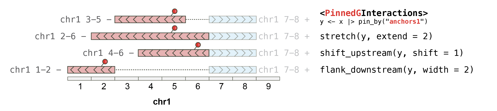
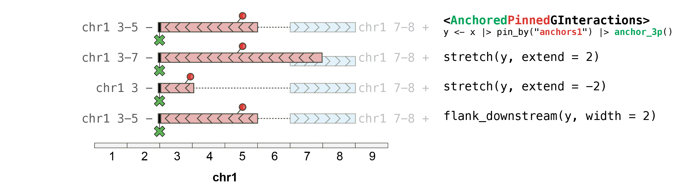

# plyinteractions

## Introduction

The
*[plyinteractions](https://bioconductor.org/packages/3.23/plyinteractions)*
package introduces tidy methods for the `GInteractions` class defined in
the
*[InteractionSet](https://bioconductor.org/packages/3.23/InteractionSet)*
package (Lun, Perry, and Ing-Simmons, 2016).

### `GInteractions` objects

`GInteractions` are objects describing interactions between two parallel
sets of genomic ranges.

``` r

library(GenomicRanges)
#> Loading required package: stats4
#> Loading required package: BiocGenerics
#> Loading required package: generics
#> 
#> Attaching package: 'generics'
#> The following objects are masked from 'package:base':
#> 
#>     as.difftime, as.factor, as.ordered, intersect, is.element, setdiff, setequal, union
#> 
#> Attaching package: 'BiocGenerics'
#> The following objects are masked from 'package:stats':
#> 
#>     IQR, mad, sd, var, xtabs
#> The following objects are masked from 'package:base':
#> 
#>     anyDuplicated, aperm, append, as.data.frame, basename, cbind, colnames, dirname, do.call, duplicated, eval, evalq, Filter, Find, get, grep, grepl, is.unsorted, lapply, Map, mapply, match, mget, order, paste, pmax, pmax.int, pmin, pmin.int, Position, rank, rbind, Reduce, rownames, sapply, saveRDS, table, tapply, unique, unsplit, which.max, which.min
#> Loading required package: S4Vectors
#> 
#> Attaching package: 'S4Vectors'
#> The following object is masked from 'package:utils':
#> 
#>     findMatches
#> The following objects are masked from 'package:base':
#> 
#>     expand.grid, I, unname
#> Loading required package: IRanges
#> Loading required package: Seqinfo
library(InteractionSet)
#> Loading required package: SummarizedExperiment
#> Loading required package: MatrixGenerics
#> Loading required package: matrixStats
#> 
#> Attaching package: 'MatrixGenerics'
#> The following objects are masked from 'package:matrixStats':
#> 
#>     colAlls, colAnyNAs, colAnys, colAvgsPerRowSet, colCollapse, colCounts, colCummaxs, colCummins, colCumprods, colCumsums, colDiffs, colIQRDiffs, colIQRs, colLogSumExps, colMadDiffs, colMads, colMaxs, colMeans2, colMedians, colMins, colOrderStats, colProds, colQuantiles, colRanges, colRanks, colSdDiffs, colSds, colSums2, colTabulates, colVarDiffs, colVars, colWeightedMads, colWeightedMeans, colWeightedMedians, colWeightedSds, colWeightedVars, rowAlls, rowAnyNAs, rowAnys, rowAvgsPerColSet, rowCollapse, rowCounts, rowCummaxs, rowCummins, rowCumprods, rowCumsums, rowDiffs, rowIQRDiffs, rowIQRs, rowLogSumExps, rowMadDiffs, rowMads, rowMaxs, rowMeans2, rowMedians, rowMins, rowOrderStats, rowProds, rowQuantiles, rowRanges, rowRanks, rowSdDiffs, rowSds, rowSums2, rowTabulates, rowVarDiffs, rowVars, rowWeightedMads, rowWeightedMeans, rowWeightedMedians, rowWeightedSds, rowWeightedVars
#> Loading required package: Biobase
#> Welcome to Bioconductor
#> 
#>     Vignettes contain introductory material; view with 'browseVignettes()'. To cite Bioconductor, see 'citation("Biobase")', and for packages 'citation("pkgname")'.
#> 
#> Attaching package: 'Biobase'
#> The following object is masked from 'package:MatrixGenerics':
#> 
#>     rowMedians
#> The following objects are masked from 'package:matrixStats':
#> 
#>     anyMissing, rowMedians
anchor1 <- GRanges("chr1:10-20:+")
anchor2 <- GRanges("chr1:50-60:-")
gi <- GInteractions(anchor1, anchor2)

gi
#> GInteractions object with 1 interaction and 0 metadata columns:
#>       seqnames1   ranges1     seqnames2   ranges2
#>           <Rle> <IRanges>         <Rle> <IRanges>
#>   [1]      chr1     10-20 ---      chr1     50-60
#>   -------
#>   regions: 2 ranges and 0 metadata columns
#>   seqinfo: 1 sequence from an unspecified genome; no seqlengths
```

The
*[InteractionSet](https://bioconductor.org/packages/3.23/InteractionSet)*
package provides basic methods to interact with this class, but does not
support tidy grammar principles.

### Tidy grammar principles

The grammar of tidy genomic data transformation defined in
*[plyranges](https://bioconductor.org/packages/3.23/plyranges)* and
available for `GInteractions` currently supports:

- *[dplyr](https://CRAN.R-project.org/package=dplyr)* verbs (for
  `GInteractions` and `GroupedGInteractions`):

  - Group genomic interactions with `group_by()`;
  - Summarize grouped genomic interactions with `summarize()`;
  - Tally/count grouped genomic interactions with `tally` and `count()`;
  - Modify genomic interactions with `mutate()`;
  - Subset genomic interactions with
    [`filter()`](https://rdrr.io/r/stats/filter.html) using
    [`<data-masking>`](https://rlang.r-lib.org/reference/args_data_masking.html)
    and logical expressions;
  - Pick out any columns from the associated metadata with `select()`
    using [`<tidy-select>`
    arguments](https://dplyr.tidyverse.org/reference/dplyr_tidy_select.html);
  - Subset using indices with
    [`slice()`](https://rdrr.io/pkg/IRanges/man/slice-methods.html);
  - Order genomic interactions with `arrange()` using
    categorical/numerical variables.

- *[plyranges](https://bioconductor.org/packages/3.23/plyranges)* verbs
  (for `PinnedGInteractions` and `AnchoredPinnedGInteractions`):

  - Stretch specific anchors of genomic interactions to a given width
    with [`stretch()`](https://rdrr.io/pkg/plyranges/man/stretch.html);
  - `anchor_*()` functions to control how stretching is performed;
  - Shift specific anchors of genomic interactions with
    [`shift()`](https://rdrr.io/pkg/IRanges/man/intra-range-methods.html);
  - Obtain flanking `GRanges` from specific anchors of genomic
    interactions with
    [`flank()`](https://rdrr.io/pkg/IRanges/man/intra-range-methods.html).

## Importing genomic interactions in R

*[plyinteractions](https://bioconductor.org/packages/3.23/plyinteractions)*
provides a consistent interface for importing genomic interactions from
`pairs` and `bedpe` files into GInteractions in R, following grammar of
tidy data manipulation defined in the
*[tidyverse](https://CRAN.R-project.org/package=tidyverse)* ecosystem.

### From bed-like text files

Tidy genomic data maniuplation implies that we first parse genomic files
stored on disk as tabular data frames.

``` r

## This uses an example `bedpe` file provided in the `rtracklayer` package
bedpe_file <- system.file("tests", "test.bedpe", package = "rtracklayer")
bedpe_df <- read.delim(bedpe_file, header = FALSE, sep = '\t')

bedpe_df
#>      V1        V2        V3    V4        V5        V6                      V7 V8 V9 V10
#> 1  chr7 118965072 118965122  chr7 118970079 118970129 TUPAC_0001:3:1:0:1452#0 37  +   -
#> 2 chr11  46765606  46765656 chr10  46769934  46769984 TUPAC_0001:3:1:0:1472#0 37  +   -
#> 3 chr20  54704674  54704724 chr20  54708987  54709037 TUPAC_0001:3:1:1:1833#0 37  +   -
```

Genomic interactions in tabular format are not easy to manipulate. We
can easily parse a `data.frame` into a `GInteractions` object using the
[`as_ginteractions()`](../reference/ginteractions-construct.md)
function.

``` r

library(plyinteractions)
#> Loading required package: plyranges
#> Loading required package: dplyr
#> 
#> Attaching package: 'dplyr'
#> The following object is masked from 'package:Biobase':
#> 
#>     combine
#> The following object is masked from 'package:matrixStats':
#> 
#>     count
#> The following objects are masked from 'package:GenomicRanges':
#> 
#>     intersect, setdiff, union
#> The following object is masked from 'package:Seqinfo':
#> 
#>     intersect
#> The following objects are masked from 'package:IRanges':
#> 
#>     collapse, desc, intersect, setdiff, slice, union
#> The following objects are masked from 'package:S4Vectors':
#> 
#>     first, intersect, rename, setdiff, setequal, union
#> The following objects are masked from 'package:BiocGenerics':
#> 
#>     combine, intersect, setdiff, setequal, union
#> The following object is masked from 'package:generics':
#> 
#>     explain
#> The following objects are masked from 'package:stats':
#> 
#>     filter, lag
#> The following objects are masked from 'package:base':
#> 
#>     intersect, setdiff, setequal, union
#> 
#> Attaching package: 'plyranges'
#> The following objects are masked from 'package:dplyr':
#> 
#>     between, n, n_distinct
#> 
#> Attaching package: 'plyinteractions'
#> The following objects are masked from 'package:plyranges':
#> 
#>     flank_downstream, flank_left, flank_right, flank_upstream, shift_downstream, shift_left, shift_right, shift_upstream
gi <- bedpe_df |> 
    as_ginteractions(
        seqnames1 = V1, start1 = V2, end1 = V3, strand1 = V9, 
        seqnames2 = V4, start2 = V5, end2 = V6, strand2 = V10, 
        starts.in.df.are.0based = TRUE
    )
#> Warning in .merge_two_Seqinfo_objects(x, y): Each of the 2 combined objects has sequence levels not in the other:
#>   - in 'x': chr11
#>   - in 'y': chr10
#>   Make sure to always combine/compare objects based on the same reference
#>   genome (use suppressWarnings() to suppress this warning).

gi
#> GInteractions object with 3 interactions and 2 metadata columns:
#>       seqnames1             ranges1 strand1     seqnames2             ranges2 strand2 |                     V7        V8
#>           <Rle>           <IRanges>   <Rle>         <Rle>           <IRanges>   <Rle> |            <character> <integer>
#>   [1]      chr7 118965073-118965122       + ---      chr7 118970080-118970129       - | TUPAC_0001:3:1:0:145..        37
#>   [2]     chr11   46765607-46765656       + ---     chr10   46769935-46769984       - | TUPAC_0001:3:1:0:147..        37
#>   [3]     chr20   54704675-54704724       + ---     chr20   54708988-54709037       - | TUPAC_0001:3:1:1:183..        37
#>   -------
#>   regions: 6 ranges and 0 metadata columns
#>   seqinfo: 4 sequences from an unspecified genome; no seqlengths
```

The columns containing information for core fields of the future
`GInteractions` object (e.g. `seqnames1`, `strand2`, …) can be specified
using the `key = value` (supported by quasiquotation).

### From `pairs` files

The `pairs` file format has been formally defined by the **4DN
consortium**. Its specifications are available
[here](https://github.com/4dn-dcic/pairix/blob/master/pairs_format_specification.md).

It can be imported in R as a `data.frame` using
[`read.delim()`](https://rdrr.io/r/utils/read.table.html) or any other
tabular data import functions (including `fread()` or `vroom()` for
larger files), and readily coerced into `GInteractions` with
[`as_ginteractions()`](../reference/ginteractions-construct.md).

``` r

## This uses an example `pairs` file provided in this package
pairs_file <- system.file('extdata', 'pairs.gz', package = 'plyinteractions') 
pairs_df <- read.delim(pairs_file, sep = "\t", header = FALSE, comment.char = "#")
head(pairs_df)
#>                                           V1 V2  V3 V4     V5 V6 V7   V8   V9
#> 1  NS500150:527:HHGYNBGXF:3:21611:19085:3986 II 105 II  48548  +  - 1358 1681
#> 2  NS500150:527:HHGYNBGXF:4:13604:19734:2406 II 113 II  45003  -  + 1358 1658
#> 3 NS500150:527:HHGYNBGXF:2:11108:25178:11036 II 119 II 687251  -  + 1358 5550
#> 4   NS500150:527:HHGYNBGXF:1:22301:8468:1586 II 160 II  26124  +  - 1358 1510
#> 5  NS500150:527:HHGYNBGXF:4:23606:24037:2076 II 169 II  39052  +  + 1358 1613
#> 6  NS500150:527:HHGYNBGXF:1:12110:9220:19806 II 177 II  10285  +  - 1358 1416
pairs <- as_ginteractions(pairs_df, 
    seqnames1 = V2, start1 = V3, strand1 = V6, 
    seqnames2 = V4, start2 = V5, strand2 = V7, 
    width1 = 1, width2 = 1, 
    keep.extra.columns = FALSE
)
pairs
#> GInteractions object with 50000 interactions and 0 metadata columns:
#>           seqnames1   ranges1 strand1     seqnames2   ranges2 strand2
#>               <Rle> <IRanges>   <Rle>         <Rle> <IRanges>   <Rle>
#>       [1]        II       105       + ---        II     48548       -
#>       [2]        II       113       - ---        II     45003       +
#>       [3]        II       119       - ---        II    687251       +
#>       [4]        II       160       + ---        II     26124       -
#>       [5]        II       169       + ---        II     39052       +
#>       ...       ...       ...     ... ...       ...       ...     ...
#>   [49996]        II     86996       + ---        II    487591       +
#>   [49997]        II     86997       + ---        II     96353       -
#>   [49998]        II     86997       + ---        II    114748       -
#>   [49999]        II     86998       + ---        II     88955       +
#>   [50000]        II     86999       + ---        II     87513       +
#>   -------
#>   regions: 62911 ranges and 0 metadata columns
#>   seqinfo: 1 sequence from an unspecified genome; no seqlengths
```

### Reverting from `GInteractions` to tabular data frames

The reverse operation to coerce `GInteractions` back to a tabular form
is also possible using the `as_tibble()` function from the
*[tibble](https://CRAN.R-project.org/package=tibble)* package:

``` r

tibble::as_tibble(gi)
#> # A tibble: 3 × 12
#>   seqnames1    start1      end1 width1 strand1 seqnames2    start2      end2 width2 strand2 V7                         V8
#>   <fct>         <int>     <int>  <int> <fct>   <fct>         <int>     <int>  <int> <fct>   <chr>                   <int>
#> 1 chr7      118965073 118965122     50 +       chr7      118970080 118970129     50 -       TUPAC_0001:3:1:0:1452#0    37
#> 2 chr11      46765607  46765656     50 +       chr10      46769935  46769984     50 -       TUPAC_0001:3:1:0:1472#0    37
#> 3 chr20      54704675  54704724     50 +       chr20      54708988  54709037     50 -       TUPAC_0001:3:1:1:1833#0    37
```

## Getter functions

### `anchors{12}`

A `GInteractions` object consists of two sets of ***anchors***:
`anchors1` and `anchors2`. Each set can be accessed with the
corresponding function
([`anchors1()`](../reference/ginteractions-getters.md) or
[`anchors2()`](../reference/ginteractions-getters.md)):



``` r

gi <- read.table(text = "
chr1 1 10 chr1 1 15 + + cis
chr1 6 15 chr1 1 20 + + cis
chr1 6 20 chr1 6 30 - - cis
chr1 11 30 chr2 11 30 - - trans",
col.names = c(
  "seqnames1", "start1", "end1", 
  "seqnames2", "start2", "end2", "strand1", "strand2", 
  "type")
) |> 
  as_ginteractions()

## `anchors` returns the two sets of anchors (i.e. "left" and "right" 
## loci) for each genomic interaction

anchors(gi)
#> $first
#> GRanges object with 4 ranges and 0 metadata columns:
#>       seqnames    ranges strand
#>          <Rle> <IRanges>  <Rle>
#>   [1]     chr1      1-10      +
#>   [2]     chr1      6-15      +
#>   [3]     chr1      6-20      -
#>   [4]     chr1     11-30      -
#>   -------
#>   seqinfo: 2 sequences from an unspecified genome; no seqlengths
#> 
#> $second
#> GRanges object with 4 ranges and 0 metadata columns:
#>       seqnames    ranges strand
#>          <Rle> <IRanges>  <Rle>
#>   [1]     chr1      1-15      +
#>   [2]     chr1      1-20      +
#>   [3]     chr1      6-30      -
#>   [4]     chr2     11-30      -
#>   -------
#>   seqinfo: 2 sequences from an unspecified genome; no seqlengths

## `anchors1` and `anchors2` specifically return the "left" OR "right" 
## loci) for each genomic interaction

anchors1(gi)
#> GRanges object with 4 ranges and 0 metadata columns:
#>       seqnames    ranges strand
#>          <Rle> <IRanges>  <Rle>
#>   [1]     chr1      1-10      +
#>   [2]     chr1      6-15      +
#>   [3]     chr1      6-20      -
#>   [4]     chr1     11-30      -
#>   -------
#>   seqinfo: 2 sequences from an unspecified genome; no seqlengths

anchors2(gi)
#> GRanges object with 4 ranges and 0 metadata columns:
#>       seqnames    ranges strand
#>          <Rle> <IRanges>  <Rle>
#>   [1]     chr1      1-15      +
#>   [2]     chr1      1-20      +
#>   [3]     chr1      6-30      -
#>   [4]     chr2     11-30      -
#>   -------
#>   seqinfo: 2 sequences from an unspecified genome; no seqlengths
```

**Important note**: the term ***anchors***, when used for
`GInteractions`, refers to the “left-hand” or “right-hand” `GRanges`
when looking at genomic interactions. This is different from the
`anchor` term used in
*[plyranges](https://bioconductor.org/packages/3.23/plyranges)*. This is
due to the fact that *“anchor”* is used in the chromatin interaction
field to refer to the ends of a potential chromatin loop.

### Core `GInteractions` fields

[`seqnames()`](https://rdrr.io/pkg/Seqinfo/man/seqinfo.html),
[`start()`](https://rdrr.io/r/stats/start.html)/[`end()`](https://rdrr.io/r/stats/start.html),
[`width()`](https://rdrr.io/pkg/BiocGenerics/man/start.html) and
[`strand()`](https://rdrr.io/pkg/BiocGenerics/man/strand.html) return
informative core fields of a `GRanges` object. Appending `1` or `2` to
these functions allow the end-user to fetch the corresponding fields
from `GInteractions` objects.

``` r

## Similarly to `GRanges` accessors, `seqnames`, `start`, `end`, `strand` and 
## `width` are all available for each set of `anchors` of a `GInteractions`. 

seqnames1(gi)
#> factor-Rle of length 4 with 1 run
#>   Lengths:    4
#>   Values : chr1
#> Levels(2): chr1 chr2

start1(gi)
#> [1]  1  6  6 11

end2(gi)
#> [1] 15 20 30 30

strand2(gi)
#> factor-Rle of length 4 with 2 runs
#>   Lengths: 2 2
#>   Values : + -
#> Levels(3): + - *

width2(gi)
#> [1] 15 20 25 20
```

### Metadata columns

`GInteractions` contain associated metadata stored as a `DataFrame`
which can be recovered using the standard
[`mcols()`](https://rdrr.io/pkg/S4Vectors/man/Vector-class.html)
function:

``` r

mcols(gi)
#> DataFrame with 4 rows and 1 column
#>          type
#>   <character>
#> 1         cis
#> 2         cis
#> 3         cis
#> 4       trans
```

Individual metadata columns can also be accessed using the `$` notation.
Auto-completion is enabled for this method.

``` r

gi$type
#> [1] "cis"   "cis"   "cis"   "trans"
```

### Extra genomic-related informations

Accessor functions provided in the
*[InteractionSet](https://bioconductor.org/packages/3.23/InteractionSet)*
package (which defines the `GInteractions` class) are also available.

``` r

regions(gi)
#> GRanges object with 8 ranges and 0 metadata columns:
#>       seqnames    ranges strand
#>          <Rle> <IRanges>  <Rle>
#>   [1]     chr1      1-10      +
#>   [2]     chr1      1-15      +
#>   [3]     chr1      1-20      +
#>   [4]     chr1      6-15      +
#>   [5]     chr1      6-20      -
#>   [6]     chr1      6-30      -
#>   [7]     chr1     11-30      -
#>   [8]     chr2     11-30      -
#>   -------
#>   seqinfo: 2 sequences from an unspecified genome; no seqlengths

seqinfo(gi)
#> Seqinfo object with 2 sequences from an unspecified genome; no seqlengths:
#>   seqnames seqlengths isCircular genome
#>   chr1             NA         NA   <NA>
#>   chr2             NA         NA   <NA>
```

## Pinned (and anchored) `GInteractions`

The anchoring approach developed in the
*[plyranges](https://bioconductor.org/packages/3.23/plyranges)* package
allows handy control over the way a `GRanges` object is extended when
using the [`stretch()`](https://rdrr.io/pkg/plyranges/man/stretch.html)
function. To enable such workflow for `GInteractions`, two classes were
defined: `PinnedGInteractions` and `AnchoredPinnedGInteractions`.



### `PinnedGInteractions`

Pinning a `GInteractions` object is used to specify which set of anchors
(i.e. `anchors1` or `anchors2`) should be affected by
*[plyranges](https://bioconductor.org/packages/3.23/plyranges)*
functions.

``` r

## `pin_by` is used to pin a `GInteractions` on "first" (i.e. "left") or 
## "second" (i.e. "right") anchors. 

gi |> pin_by("first")
#> PinnedGInteractions object with 4 interactions and 1 metadata column:
#> Pinned on: anchors1
#>       seqnames1   ranges1 strand1     seqnames2   ranges2 strand2 |        type
#>           <Rle> <IRanges>   <Rle>         <Rle> <IRanges>   <Rle> | <character>
#>   [1]      chr1      1-10       + ---      chr1      1-15       + |         cis
#>   [2]      chr1      6-15       + ---      chr1      1-20       + |         cis
#>   [3]      chr1      6-20       - ---      chr1      6-30       - |         cis
#>   [4]      chr1     11-30       - ---      chr2     11-30       - |       trans
#>   -------
#>   regions: 8 ranges and 0 metadata columns
#>   seqinfo: 2 sequences from an unspecified genome; no seqlengths

pgi <- gi |> pin_by("second")
pin(pgi)
#> [1] 2

pinned_anchors(pgi)
#> GRanges object with 4 ranges and 0 metadata columns:
#>       seqnames    ranges strand
#>          <Rle> <IRanges>  <Rle>
#>   [1]     chr1      1-15      +
#>   [2]     chr1      1-20      +
#>   [3]     chr1      6-30      -
#>   [4]     chr2     11-30      -
#>   -------
#>   seqinfo: 2 sequences from an unspecified genome; no seqlengths
```

A pinned `GInteractions` object can be reverted back to a unpinned
`GInteractions` object.

``` r

unpin(pgi)
#> GInteractions object with 4 interactions and 1 metadata column:
#>       seqnames1   ranges1 strand1     seqnames2   ranges2 strand2 |        type
#>           <Rle> <IRanges>   <Rle>         <Rle> <IRanges>   <Rle> | <character>
#>   [1]      chr1      1-10       + ---      chr1      1-15       + |         cis
#>   [2]      chr1      6-15       + ---      chr1      1-20       + |         cis
#>   [3]      chr1      6-20       - ---      chr1      6-30       - |         cis
#>   [4]      chr1     11-30       - ---      chr2     11-30       - |       trans
#>   -------
#>   regions: 8 ranges and 0 metadata columns
#>   seqinfo: 2 sequences from an unspecified genome; no seqlengths
```

### `AnchoredPinnedGInteractions`

Some *[plyranges](https://bioconductor.org/packages/3.23/plyranges)*
operations can work on “`anchored"` ***`GRanges`***. To enable these
operations either on `anchors1` or `anchors2` from a
***`GInteractions`*** object, the”pinned” `anchors{12}` of the
`GInteractions` object can be further “anchored”.

``` r

gi |> pin_by("first") |> anchor_5p()
#> AnchoredPinnedGInteractions object with 4 interactions and 1 metadata column:
#> Pinned on: anchors1 | Anchored by: 5p
#>       seqnames1   ranges1 strand1     seqnames2   ranges2 strand2 |        type
#>           <Rle> <IRanges>   <Rle>         <Rle> <IRanges>   <Rle> | <character>
#>   [1]      chr1      1-10       + ---      chr1      1-15       + |         cis
#>   [2]      chr1      6-15       + ---      chr1      1-20       + |         cis
#>   [3]      chr1      6-20       - ---      chr1      6-30       - |         cis
#>   [4]      chr1     11-30       - ---      chr2     11-30       - |       trans
#>   -------
#>   regions: 8 ranges and 0 metadata columns
#>   seqinfo: 2 sequences from an unspecified genome; no seqlengths
```

## `plyranges` operations on `GInteractions`

*[plyranges](https://bioconductor.org/packages/3.23/plyranges)*
arithmetic functions are available for `(Anchored)PinnedGInteractions`
objects.

**Important note 1:** `GInteractions` must be pinned to a specific
anchor set (`anchors1` or `anchors2`) for
*[plyranges](https://bioconductor.org/packages/3.23/plyranges)*
functions to work. Please use
[`pin_by()`](../reference/ginteractions-pin.md) function to pin
`GInteractions`.

**Important note 2:** the
[`stretch()`](https://rdrr.io/pkg/plyranges/man/stretch.html) function
will behave on `PinnedGInteractions` and `AnchoredPinnedGInteractions`
objects similarly to `GRanges` or `AnchoredGRanges` objects.

### On `PinnedGInteractions` objects

*[plyinteractions](https://bioconductor.org/packages/3.23/plyinteractions)*
extends the use of verbs developed in `plyranges` to manipulate
`GRanges` objects, to ensure they work on `GInteractions`. The
`GInteractions` **must** be “pinned” (using
[`pin_by()`](../reference/ginteractions-pin.md)) in order to specify
which set of anchors should be affected by `plyranges` functions.



``` r

gi
#> GInteractions object with 4 interactions and 1 metadata column:
#>       seqnames1   ranges1 strand1     seqnames2   ranges2 strand2 |        type
#>           <Rle> <IRanges>   <Rle>         <Rle> <IRanges>   <Rle> | <character>
#>   [1]      chr1      1-10       + ---      chr1      1-15       + |         cis
#>   [2]      chr1      6-15       + ---      chr1      1-20       + |         cis
#>   [3]      chr1      6-20       - ---      chr1      6-30       - |         cis
#>   [4]      chr1     11-30       - ---      chr2     11-30       - |       trans
#>   -------
#>   regions: 8 ranges and 0 metadata columns
#>   seqinfo: 2 sequences from an unspecified genome; no seqlengths

## This pins the "first" (i.e. "left") anchors and strecthes them by 10bp

gi |> pin_by("first") |> stretch(10)
#> PinnedGInteractions object with 4 interactions and 1 metadata column:
#> Pinned on: anchors1
#>       seqnames1   ranges1 strand1     seqnames2   ranges2 strand2 |        type
#>           <Rle> <IRanges>   <Rle>         <Rle> <IRanges>   <Rle> | <character>
#>   [1]      chr1     -4-15       + ---      chr1      1-15       + |         cis
#>   [2]      chr1      1-20       + ---      chr1      1-20       + |         cis
#>   [3]      chr1      1-25       - ---      chr1      6-30       - |         cis
#>   [4]      chr1      6-35       - ---      chr2     11-30       - |       trans
#>   -------
#>   regions: 7 ranges and 0 metadata columns
#>   seqinfo: 2 sequences from an unspecified genome; no seqlengths

## This pins the "first" (i.e. "left") anchors and shift them 
## by 20bp to the right

gi |> pin_by("first") |> shift_right(20)
#> PinnedGInteractions object with 4 interactions and 1 metadata column:
#> Pinned on: anchors1
#>       seqnames1   ranges1 strand1     seqnames2   ranges2 strand2 |        type
#>           <Rle> <IRanges>   <Rle>         <Rle> <IRanges>   <Rle> | <character>
#>   [1]      chr1     21-30       + ---      chr1      1-15       + |         cis
#>   [2]      chr1     26-35       + ---      chr1      1-20       + |         cis
#>   [3]      chr1     26-40       - ---      chr1      6-30       - |         cis
#>   [4]      chr1     31-50       - ---      chr2     11-30       - |       trans
#>   -------
#>   regions: 8 ranges and 0 metadata columns
#>   seqinfo: 2 sequences from an unspecified genome; no seqlengths

## This pins the "first" (i.e. "left") anchors and extracts 20bp 
## flanking these "first" anchors

gi |> pin_by("first") |> flank_right(20)
#> PinnedGInteractions object with 4 interactions and 1 metadata column:
#> Pinned on: anchors1
#>       seqnames1   ranges1 strand1     seqnames2   ranges2 strand2 |        type
#>           <Rle> <IRanges>   <Rle>         <Rle> <IRanges>   <Rle> | <character>
#>   [1]      chr1     11-30       + ---      chr1      1-15       + |         cis
#>   [2]      chr1     16-35       + ---      chr1      1-20       + |         cis
#>   [3]      chr1     21-40       - ---      chr1      6-30       - |         cis
#>   [4]      chr1     31-50       - ---      chr2     11-30       - |       trans
#>   -------
#>   regions: 8 ranges and 0 metadata columns
#>   seqinfo: 2 sequences from an unspecified genome; no seqlengths
```

### On `AnchoredPinnedGInteractions` objects

When a pinned `GInteractions` is further anchored, `stretch`ing with
*[plyranges](https://bioconductor.org/packages/3.23/plyranges)* relies
on the anchoring:



``` r

## This pins the "first" (i.e. "left") anchors and strecthes them by 10bp, 
## with the "first" anchors being anchored at their **start**. 

gi |> pin_by("first") |> anchor_start() |> stretch(10)
#> PinnedGInteractions object with 4 interactions and 1 metadata column:
#> Pinned on: anchors1
#>       seqnames1   ranges1 strand1     seqnames2   ranges2 strand2 |        type
#>           <Rle> <IRanges>   <Rle>         <Rle> <IRanges>   <Rle> | <character>
#>   [1]      chr1      1-20       + ---      chr1      1-15       + |         cis
#>   [2]      chr1      6-25       + ---      chr1      1-20       + |         cis
#>   [3]      chr1      6-30       - ---      chr1      6-30       - |         cis
#>   [4]      chr1     11-40       - ---      chr2     11-30       - |       trans
#>   -------
#>   regions: 6 ranges and 0 metadata columns
#>   seqinfo: 2 sequences from an unspecified genome; no seqlengths

## This pins the "first" (i.e. "left") anchors and strecthes them by 10bp, 
## with the "first" anchors being anchored at their **center**. 

gi |> pin_by("first") |> anchor_center() |> stretch(10)
#> PinnedGInteractions object with 4 interactions and 1 metadata column:
#> Pinned on: anchors1
#>       seqnames1   ranges1 strand1     seqnames2   ranges2 strand2 |        type
#>           <Rle> <IRanges>   <Rle>         <Rle> <IRanges>   <Rle> | <character>
#>   [1]      chr1     -4-15       + ---      chr1      1-15       + |         cis
#>   [2]      chr1      1-20       + ---      chr1      1-20       + |         cis
#>   [3]      chr1      1-25       - ---      chr1      6-30       - |         cis
#>   [4]      chr1      6-35       - ---      chr2     11-30       - |       trans
#>   -------
#>   regions: 7 ranges and 0 metadata columns
#>   seqinfo: 2 sequences from an unspecified genome; no seqlengths
```

## `dplyr` operations on `GInteractions`

*[plyinteractions](https://bioconductor.org/packages/3.23/plyinteractions)*
provides a set of verbs for developing analysis pipelines based on
`GInteractions` objects that represent genomic interactions. The verbs
extend *[dplyr](https://CRAN.R-project.org/package=dplyr)*
functionalities to operate on a `GInteractions` object as if it were a
tabular data object.

### Mutating columns

`mutate()` supports accessing other existing columns:

``` r

## This creates a new metadata column named `cis`

gi |> mutate(cis = seqnames1 == seqnames2)
#> GInteractions object with 4 interactions and 2 metadata columns:
#>       seqnames1   ranges1 strand1     seqnames2   ranges2 strand2 |        type   cis
#>           <Rle> <IRanges>   <Rle>         <Rle> <IRanges>   <Rle> | <character> <Rle>
#>   [1]      chr1      1-10       + ---      chr1      1-15       + |         cis  TRUE
#>   [2]      chr1      6-15       + ---      chr1      1-20       + |         cis  TRUE
#>   [3]      chr1      6-20       - ---      chr1      6-30       - |         cis  TRUE
#>   [4]      chr1     11-30       - ---      chr2     11-30       - |       trans FALSE
#>   -------
#>   regions: 8 ranges and 0 metadata columns
#>   seqinfo: 2 sequences from an unspecified genome; no seqlengths

## This creates a new metadata column named `both_chr`

gi |> mutate(both_chr = paste(seqnames1, seqnames2, sep = "_"))
#> GInteractions object with 4 interactions and 2 metadata columns:
#>       seqnames1   ranges1 strand1     seqnames2   ranges2 strand2 |        type  both_chr
#>           <Rle> <IRanges>   <Rle>         <Rle> <IRanges>   <Rle> | <character>     <Rle>
#>   [1]      chr1      1-10       + ---      chr1      1-15       + |         cis chr1_chr1
#>   [2]      chr1      6-15       + ---      chr1      1-20       + |         cis chr1_chr1
#>   [3]      chr1      6-20       - ---      chr1      6-30       - |         cis chr1_chr1
#>   [4]      chr1     11-30       - ---      chr2     11-30       - |       trans chr1_chr2
#>   -------
#>   regions: 8 ranges and 0 metadata columns
#>   seqinfo: 2 sequences from an unspecified genome; no seqlengths

## This modifies `start1`, i.e. the `start` coordinates of the "first"
## (i.e. "left") anchors of the `GInteractions` object. 

gi |> mutate(start1 = 1)
#> GInteractions object with 4 interactions and 1 metadata column:
#>       seqnames1   ranges1 strand1     seqnames2   ranges2 strand2 |        type
#>           <Rle> <IRanges>   <Rle>         <Rle> <IRanges>   <Rle> | <character>
#>   [1]      chr1      1-10       + ---      chr1      1-15       + |         cis
#>   [2]      chr1      1-15       + ---      chr1      1-20       + |         cis
#>   [3]      chr1      1-20       - ---      chr1      6-30       - |         cis
#>   [4]      chr1      1-30       - ---      chr2     11-30       - |       trans
#>   -------
#>   regions: 7 ranges and 0 metadata columns
#>   seqinfo: 2 sequences from an unspecified genome; no seqlengths
```

### Grouping columns

`group_by()` supports accessing both core and metadata columns:

``` r

## This groups the `GInteractions` object using the `seqnames2` variable
## (i.e. the `seqnames` of the "second" anchors of the `GInteractions`). 

gi |> group_by(seqnames2)
#> GroupedGInteractions object with 4 interactions and 1 metadata column:
#> Groups: seqnames2 [2]
#>       seqnames1   ranges1 strand1     seqnames2   ranges2 strand2 |        type
#>           <Rle> <IRanges>   <Rle>         <Rle> <IRanges>   <Rle> | <character>
#>   [1]      chr1      1-10       + ---      chr1      1-15       + |         cis
#>   [2]      chr1      6-15       + ---      chr1      1-20       + |         cis
#>   [3]      chr1      6-20       - ---      chr1      6-30       - |         cis
#>   [4]      chr1     11-30       - ---      chr2     11-30       - |       trans
#>   -------
#>   regions: 8 ranges and 0 metadata columns
#>   seqinfo: 2 sequences from an unspecified genome; no seqlengths

## This groups the `GInteractions` object by a new variable named `cis`

gi |> group_by(cis = seqnames1 == seqnames2)
#> GroupedGInteractions object with 4 interactions and 2 metadata columns:
#> Groups: cis [2]
#>       seqnames1   ranges1 strand1     seqnames2   ranges2 strand2 |        type   cis
#>           <Rle> <IRanges>   <Rle>         <Rle> <IRanges>   <Rle> | <character> <Rle>
#>   [1]      chr1      1-10       + ---      chr1      1-15       + |         cis  TRUE
#>   [2]      chr1      6-15       + ---      chr1      1-20       + |         cis  TRUE
#>   [3]      chr1      6-20       - ---      chr1      6-30       - |         cis  TRUE
#>   [4]      chr1     11-30       - ---      chr2     11-30       - |       trans FALSE
#>   -------
#>   regions: 8 ranges and 0 metadata columns
#>   seqinfo: 2 sequences from an unspecified genome; no seqlengths

## This groups the `GInteractions` object by two variables, `seqnames2` 
## and the new variable `cis`

gi |> group_by(seqnames2, cis = seqnames1 == seqnames2)
#> GroupedGInteractions object with 4 interactions and 2 metadata columns:
#> Groups: seqnames2, cis [2]
#>       seqnames1   ranges1 strand1     seqnames2   ranges2 strand2 |        type   cis
#>           <Rle> <IRanges>   <Rle>         <Rle> <IRanges>   <Rle> | <character> <Rle>
#>   [1]      chr1      1-10       + ---      chr1      1-15       + |         cis  TRUE
#>   [2]      chr1      6-15       + ---      chr1      1-20       + |         cis  TRUE
#>   [3]      chr1      6-20       - ---      chr1      6-30       - |         cis  TRUE
#>   [4]      chr1     11-30       - ---      chr2     11-30       - |       trans FALSE
#>   -------
#>   regions: 8 ranges and 0 metadata columns
#>   seqinfo: 2 sequences from an unspecified genome; no seqlengths
```

### Summarizing columns

Summarizing grouped `GInteractions` with `summarize()` can be extremely
powerful.

``` r

## This counts the number of occurences of each combination of the variables
## `strand1` and `strand2`

pairs |> count(strand1, strand2)
#> DataFrame with 4 rows and 3 columns
#>   strand1 strand2         n
#>     <Rle>   <Rle> <integer>
#> 1       +       +     14046
#> 2       +       -     10823
#> 3       -       +     10288
#> 4       -       -     14843

## This counts the number of pairs located on the same strand 
## or different strands

gi |> group_by(same_strand = strand1 == strand2) |> tally()
#> DataFrame with 1 row and 2 columns
#>   same_strand         n
#>         <Rle> <integer>
#> 1        TRUE         4

## This counts the number of pairs located on the same strand 
## or different strands

pairs |> group_by(same_strand = strand1 == strand2) |> 
    summarize(
        neg_strand = sum(strand1 == "-"), 
        pos_strand = sum(strand1 == "+")
    )
#> DataFrame with 2 rows and 3 columns
#>   same_strand neg_strand pos_strand
#>         <Rle>  <integer>  <integer>
#> 1       FALSE      10288      10823
#> 2        TRUE      14843      14046
```

### Filtering columns

[`filter()`](https://rdrr.io/r/stats/filter.html) supports logical
expressions:

``` r

gi |> filter(seqnames1 == 'chr11')
#> GInteractions object with 0 interactions and 1 metadata column:
#>    seqnames1   ranges1 strand1     seqnames2   ranges2 strand2 |        type
#>        <Rle> <IRanges>   <Rle>         <Rle> <IRanges>   <Rle> | <character>
#>   -------
#>   regions: 8 ranges and 0 metadata columns
#>   seqinfo: 2 sequences from an unspecified genome; no seqlengths

gi |> filter(start1 >= 1e8)
#> GInteractions object with 0 interactions and 1 metadata column:
#>    seqnames1   ranges1 strand1     seqnames2   ranges2 strand2 |        type
#>        <Rle> <IRanges>   <Rle>         <Rle> <IRanges>   <Rle> | <character>
#>   -------
#>   regions: 8 ranges and 0 metadata columns
#>   seqinfo: 2 sequences from an unspecified genome; no seqlengths

gi |> filter(seqnames1 == seqnames2)
#> GInteractions object with 3 interactions and 1 metadata column:
#>       seqnames1   ranges1 strand1     seqnames2   ranges2 strand2 |        type
#>           <Rle> <IRanges>   <Rle>         <Rle> <IRanges>   <Rle> | <character>
#>   [1]      chr1      1-10       + ---      chr1      1-15       + |         cis
#>   [2]      chr1      6-15       + ---      chr1      1-20       + |         cis
#>   [3]      chr1      6-20       - ---      chr1      6-30       - |         cis
#>   -------
#>   regions: 8 ranges and 0 metadata columns
#>   seqinfo: 2 sequences from an unspecified genome; no seqlengths
```

### Selecting columns

`select()` supports [`<tidy-select>`
arguments](https://dplyr.tidyverse.org/reference/dplyr_tidy_select.html):

``` r

## This only keeps the "type" column from the metadata columns, 
## using <tidy-select> methodology

gi |> select(type)
#> GInteractions object with 4 interactions and 1 metadata column:
#>       seqnames1   ranges1 strand1     seqnames2   ranges2 strand2 |        type
#>           <Rle> <IRanges>   <Rle>         <Rle> <IRanges>   <Rle> | <character>
#>   [1]      chr1      1-10       + ---      chr1      1-15       + |         cis
#>   [2]      chr1      6-15       + ---      chr1      1-20       + |         cis
#>   [3]      chr1      6-20       - ---      chr1      6-30       - |         cis
#>   [4]      chr1     11-30       - ---      chr2     11-30       - |       trans
#>   -------
#>   regions: 8 ranges and 0 metadata columns
#>   seqinfo: 2 sequences from an unspecified genome; no seqlengths

gi |> select(contains("typ"))
#> GInteractions object with 4 interactions and 1 metadata column:
#>       seqnames1   ranges1 strand1     seqnames2   ranges2 strand2 |        type
#>           <Rle> <IRanges>   <Rle>         <Rle> <IRanges>   <Rle> | <character>
#>   [1]      chr1      1-10       + ---      chr1      1-15       + |         cis
#>   [2]      chr1      6-15       + ---      chr1      1-20       + |         cis
#>   [3]      chr1      6-20       - ---      chr1      6-30       - |         cis
#>   [4]      chr1     11-30       - ---      chr2     11-30       - |       trans
#>   -------
#>   regions: 8 ranges and 0 metadata columns
#>   seqinfo: 2 sequences from an unspecified genome; no seqlengths

gi |> select(starts_with("ty"))
#> GInteractions object with 4 interactions and 1 metadata column:
#>       seqnames1   ranges1 strand1     seqnames2   ranges2 strand2 |        type
#>           <Rle> <IRanges>   <Rle>         <Rle> <IRanges>   <Rle> | <character>
#>   [1]      chr1      1-10       + ---      chr1      1-15       + |         cis
#>   [2]      chr1      6-15       + ---      chr1      1-20       + |         cis
#>   [3]      chr1      6-20       - ---      chr1      6-30       - |         cis
#>   [4]      chr1     11-30       - ---      chr2     11-30       - |       trans
#>   -------
#>   regions: 8 ranges and 0 metadata columns
#>   seqinfo: 2 sequences from an unspecified genome; no seqlengths
```

Note that core fields (e.g. `seqnames1`, `strand2`, …) cannot be
retrieved using this approach, only metadata columns are parsed.
Selecting a subset of core fields from a `GInteractions` would lead to
loss of required information (the other non-selected core fields).

``` r

## This does not restrict to `seqnames1` and `seqnames2` columns. 

gi |> select(starts_with('seq')) 
#> GInteractions object with 4 interactions and 0 metadata columns:
#>       seqnames1   ranges1 strand1     seqnames2   ranges2 strand2
#>           <Rle> <IRanges>   <Rle>         <Rle> <IRanges>   <Rle>
#>   [1]      chr1      1-10       + ---      chr1      1-15       +
#>   [2]      chr1      6-15       + ---      chr1      1-20       +
#>   [3]      chr1      6-20       - ---      chr1      6-30       -
#>   [4]      chr1     11-30       - ---      chr2     11-30       -
#>   -------
#>   regions: 8 ranges and 0 metadata columns
#>   seqinfo: 2 sequences from an unspecified genome; no seqlengths
```

Forcing selection of core fields is still possible when using the
`.drop_ranges` argument of `select()`. This results in the coercion of
the selected columns into a `DataFrame`.

``` r

## This selects `seqnames1` and `seqnames2` columns but converts the output
## into a `DataFrame`.

gi |> select(starts_with('seq'), .drop_ranges = TRUE) 
#> DataFrame with 4 rows and 2 columns
#>   seqnames1 seqnames2
#>       <Rle>     <Rle>
#> 1      chr1      chr1
#> 2      chr1      chr1
#> 3      chr1      chr1
#> 4      chr1      chr2
```

### Slicing rows

``` r

## This only retains specific pair indices

gi |> slice(1, 2)
#> GInteractions object with 2 interactions and 1 metadata column:
#>       seqnames1   ranges1 strand1     seqnames2   ranges2 strand2 |        type
#>           <Rle> <IRanges>   <Rle>         <Rle> <IRanges>   <Rle> | <character>
#>   [1]      chr1      1-10       + ---      chr1      1-15       + |         cis
#>   [2]      chr1      6-15       + ---      chr1      1-20       + |         cis
#>   -------
#>   regions: 8 ranges and 0 metadata columns
#>   seqinfo: 2 sequences from an unspecified genome; no seqlengths

gi |> slice(-3)
#> GInteractions object with 3 interactions and 1 metadata column:
#>       seqnames1   ranges1 strand1     seqnames2   ranges2 strand2 |        type
#>           <Rle> <IRanges>   <Rle>         <Rle> <IRanges>   <Rle> | <character>
#>   [1]      chr1      1-10       + ---      chr1      1-15       + |         cis
#>   [2]      chr1      6-15       + ---      chr1      1-20       + |         cis
#>   [3]      chr1     11-30       - ---      chr2     11-30       - |       trans
#>   -------
#>   regions: 8 ranges and 0 metadata columns
#>   seqinfo: 2 sequences from an unspecified genome; no seqlengths
```

## Overlapping operations on `GInteractions`

Several operlapping functions defined in
*[plyranges](https://bioconductor.org/packages/3.23/plyranges)* are
available for `GInteractions`:

- [`find_overlaps()`](https://rdrr.io/pkg/plyranges/man/ranges-overlaps.html);
- [`count_overlaps()`](https://rdrr.io/pkg/plyranges/man/ranges-count-overlaps.html);
- [`filter_by_overlaps()`](https://rdrr.io/pkg/plyranges/man/ranges-filter-overlaps.html)
  and
  [`filter_by_non_overlaps()`](https://rdrr.io/pkg/plyranges/man/ranges-filter-overlaps.html);
- [`join_overlap_left()`](https://rdrr.io/pkg/plyranges/man/overlap-joins.html).

All these functions can take a `GInteractions` query and a `GRanges`
subject to perform overlapping operations, and `maxgap` and `minoverlap`
arguments are available to refine the query.

These functions are **unstranded** by default.
[`find_overlaps()`](https://rdrr.io/pkg/plyranges/man/ranges-overlaps.html),
[`count_overlaps()`](https://rdrr.io/pkg/plyranges/man/ranges-count-overlaps.html)
and
[`join_overlap_left()`](https://rdrr.io/pkg/plyranges/man/overlap-joins.html)
functions have `*_directed()` counterparts for when strandness is
required.

### Overlapping `GInteractions`

`overlap`ping methods defined for `GInteractions` have also been adapted
to work in a “tidy” manner.

``` r

gr <- GRanges(c("chr1:25-30:-", "chr2:16-20:+"))
gi$id <- seq_len(length(gi))
gr$id <- seq_len(length(gr))

## This returns the `GInteractions` entries overlapping with a `GRanges`
## (with either of both anchors)

find_overlaps(gi, gr)
#> GInteractions object with 3 interactions and 3 metadata columns:
#>       seqnames1   ranges1 strand1     seqnames2   ranges2 strand2 |        type      id.x      id.y
#>           <Rle> <IRanges>   <Rle>         <Rle> <IRanges>   <Rle> | <character> <integer> <integer>
#>   [1]      chr1      6-20       - ---      chr1      6-30       - |         cis         3         1
#>   [2]      chr1     11-30       - ---      chr2     11-30       - |       trans         4         1
#>   [3]      chr1     11-30       - ---      chr2     11-30       - |       trans         4         2
#>   -------
#>   regions: 8 ranges and 0 metadata columns
#>   seqinfo: 2 sequences from an unspecified genome; no seqlengths

## This overlap requires the same strandness between 
## the `GInteractions` anchors and the `GRanges` object

find_overlaps_directed(gi, gr)
#> GInteractions object with 2 interactions and 3 metadata columns:
#>       seqnames1   ranges1 strand1     seqnames2   ranges2 strand2 |        type      id.x      id.y
#>           <Rle> <IRanges>   <Rle>         <Rle> <IRanges>   <Rle> | <character> <integer> <integer>
#>   [1]      chr1      6-20       - ---      chr1      6-30       - |         cis         3         1
#>   [2]      chr1     11-30       - ---      chr2     11-30       - |       trans         4         1
#>   -------
#>   regions: 8 ranges and 0 metadata columns
#>   seqinfo: 2 sequences from an unspecified genome; no seqlengths

## This counts how many times each entry in a `GInteractions` object 
## overlaps with a `GRanges` object (with either of both anchors)

count_overlaps(gi, gr)
#> [1] 0 0 1 2

count_overlaps_directed(gi, gr)
#> [1] 0 0 1 1

## This filters a `GInteractions` object to only retain the entries 
## overlapping (or not) with a `GRanges` (with either of both anchors)

filter_by_overlaps(gi, gr)
#> GInteractions object with 2 interactions and 2 metadata columns:
#>       seqnames1   ranges1 strand1     seqnames2   ranges2 strand2 |        type        id
#>           <Rle> <IRanges>   <Rle>         <Rle> <IRanges>   <Rle> | <character> <integer>
#>   [1]      chr1      6-20       - ---      chr1      6-30       - |         cis         3
#>   [2]      chr1     11-30       - ---      chr2     11-30       - |       trans         4
#>   -------
#>   regions: 8 ranges and 0 metadata columns
#>   seqinfo: 2 sequences from an unspecified genome; no seqlengths

filter_by_non_overlaps(gi, gr)
#> GInteractions object with 2 interactions and 2 metadata columns:
#>       seqnames1   ranges1 strand1     seqnames2   ranges2 strand2 |        type        id
#>           <Rle> <IRanges>   <Rle>         <Rle> <IRanges>   <Rle> | <character> <integer>
#>   [1]      chr1      1-10       + ---      chr1      1-15       + |         cis         1
#>   [2]      chr1      6-15       + ---      chr1      1-20       + |         cis         2
#>   -------
#>   regions: 8 ranges and 0 metadata columns
#>   seqinfo: 2 sequences from an unspecified genome; no seqlengths

## This performs a left join between `GInteractions` entries and
## a `GRanges` of interest (with/without considering strandness)

join_overlap_left(gi, gr)
#> GInteractions object with 5 interactions and 3 metadata columns:
#>       seqnames1   ranges1 strand1     seqnames2   ranges2 strand2 |        type      id.x      id.y
#>           <Rle> <IRanges>   <Rle>         <Rle> <IRanges>   <Rle> | <character> <integer> <integer>
#>   [1]      chr1      1-10       + ---      chr1      1-15       + |         cis         1      <NA>
#>   [2]      chr1      6-15       + ---      chr1      1-20       + |         cis         2      <NA>
#>   [3]      chr1      6-20       - ---      chr1      6-30       - |         cis         3         1
#>   [4]      chr1     11-30       - ---      chr2     11-30       - |       trans         4         1
#>   [5]      chr1     11-30       - ---      chr2     11-30       - |       trans         4         2
#>   -------
#>   regions: 8 ranges and 0 metadata columns
#>   seqinfo: 2 sequences from an unspecified genome; no seqlengths

join_overlap_left_directed(gi, gr)
#> GInteractions object with 4 interactions and 3 metadata columns:
#>       seqnames1   ranges1 strand1     seqnames2   ranges2 strand2 |        type      id.x      id.y
#>           <Rle> <IRanges>   <Rle>         <Rle> <IRanges>   <Rle> | <character> <integer> <integer>
#>   [1]      chr1      1-10       + ---      chr1      1-15       + |         cis         1      <NA>
#>   [2]      chr1      6-15       + ---      chr1      1-20       + |         cis         2      <NA>
#>   [3]      chr1      6-20       - ---      chr1      6-30       - |         cis         3         1
#>   [4]      chr1     11-30       - ---      chr2     11-30       - |       trans         4         1
#>   -------
#>   regions: 8 ranges and 0 metadata columns
#>   seqinfo: 2 sequences from an unspecified genome; no seqlengths
```

### Overlapping pinned `GInteractions`

`PinnedGInteractions` can also be used in overlapping functions. In this
case, only the pinned anchors are used when computing overlaps.

``` r

## This returns the `GInteractions` entries for which 
## the "first" anchor overlaps with a `GRanges`

gi |> pin_by("first") |> find_overlaps(gr)
#> GInteractions object with 1 interaction and 3 metadata columns:
#>       seqnames1   ranges1 strand1     seqnames2   ranges2 strand2 |        type      id.x      id.y
#>           <Rle> <IRanges>   <Rle>         <Rle> <IRanges>   <Rle> | <character> <integer> <integer>
#>   [1]      chr1     11-30       - ---      chr2     11-30       - |       trans         4         1
#>   -------
#>   regions: 8 ranges and 0 metadata columns
#>   seqinfo: 2 sequences from an unspecified genome; no seqlengths

## This returns the `GInteractions` entries for which 
## the "second" anchor overlaps with a `GRanges`

gi |> pin_by("second") |> find_overlaps(gr)
#> GInteractions object with 2 interactions and 3 metadata columns:
#>       seqnames1   ranges1 strand1     seqnames2   ranges2 strand2 |        type      id.x      id.y
#>           <Rle> <IRanges>   <Rle>         <Rle> <IRanges>   <Rle> | <character> <integer> <integer>
#>   [1]      chr1      6-20       - ---      chr1      6-30       - |         cis         3         1
#>   [2]      chr1     11-30       - ---      chr2     11-30       - |       trans         4         2
#>   -------
#>   regions: 8 ranges and 0 metadata columns
#>   seqinfo: 2 sequences from an unspecified genome; no seqlengths
```

## Citing `plyinteractions`

We hope that
*[plyinteractions](https://bioconductor.org/packages/3.23/plyinteractions)*
will be useful for your research. Please use the following information
to cite the package and the overall approach. Thank you!

``` r

## Citation info
citation("plyinteractions")
#> To cite package 'plyinteractions' in publications use:
#> 
#>   Serizay J (2026). _plyinteractions: Extending tidy verbs to genomic interactions_. R package version 1.9.0, <https://github.com/js2264/plyinteractions>.
#> 
#> A BibTeX entry for LaTeX users is
#> 
#>   @Manual{,
#>     title = {plyinteractions: Extending tidy verbs to genomic interactions},
#>     author = {Jacques Serizay},
#>     year = {2026},
#>     note = {R package version 1.9.0},
#>     url = {https://github.com/js2264/plyinteractions},
#>   }
```

## Acknowledgments

The
*[plyinteractions](https://bioconductor.org/packages/3.23/plyinteractions)*
package introduces tidy methods for the `GInteractions` class defined in
the
*[InteractionSet](https://bioconductor.org/packages/3.23/InteractionSet)*
package (Lun, Perry, and Ing-Simmons, 2016).

The
*[plyinteractions](https://bioconductor.org/packages/3.23/plyinteractions)*
package follows tidy principles defined for tabular data and genomic
ranges:

- *[dplyr](https://CRAN.R-project.org/package=dplyr)* (Wickham,
  François, Henry, Müller, and Vaughan, 2023)
- *[rlang](https://CRAN.R-project.org/package=rlang)* (Henry and
  Wickham, 2025)
- *[plyranges](https://bioconductor.org/packages/3.23/plyranges)* (Lee,
  Stuart, Cook, Dianne, Lawrence, and Michael, 2019)

The
*[plyinteractions](https://bioconductor.org/packages/3.23/plyinteractions)*
package (Serizay, 2026) was written using the following resources:

- R (R Core Team, 2026)
- *[devtools](https://CRAN.R-project.org/package=devtools)*
- *[usethis](https://CRAN.R-project.org/package=usethis)*

Supporting documentation was generated using the following resources:

- *[BiocStyle](https://bioconductor.org/packages/3.23/BiocStyle)* (Oleś,
  2025)
- *[knitr](https://CRAN.R-project.org/package=knitr)* (Xie, 2025)
- *[RefManageR](https://CRAN.R-project.org/package=RefManageR)* (McLean,
  2017)
- *[rmarkdown](https://CRAN.R-project.org/package=rmarkdown)* (Allaire,
  Xie, Dervieux, McPherson, Luraschi, Ushey, Atkins, Wickham, Cheng,
  Chang, and Iannone, 2025)

## Reproducibility

`R` session information:

    #> ─ Session info ───────────────────────────────────────────────────────────────────────────────────────────────────────
    #>  setting  value
    #>  version  R Under development (unstable) (2026-01-03 r89269)
    #>  os       Ubuntu 24.04.3 LTS
    #>  system   x86_64, linux-gnu
    #>  ui       X11
    #>  language en
    #>  collate  en_US.UTF-8
    #>  ctype    en_US.UTF-8
    #>  tz       UTC
    #>  date     2026-01-07
    #>  pandoc   3.8.3 @ /usr/bin/ (via rmarkdown)
    #>  quarto   1.8.26 @ /usr/local/bin/quarto
    #> 
    #> ─ Packages ───────────────────────────────────────────────────────────────────────────────────────────────────────────
    #>  package              * version   date (UTC) lib source
    #>  abind                  1.4-8     2024-09-12 [1] CRAN (R 4.6.0)
    #>  backports              1.5.0     2024-05-23 [1] CRAN (R 4.6.0)
    #>  bibtex                 0.5.1     2023-01-26 [1] CRAN (R 4.6.0)
    #>  Biobase              * 2.71.0    2025-10-30 [1] Bioconductor 3.23 (R 4.6.0)
    #>  BiocGenerics         * 0.57.0    2025-10-30 [1] Bioconductor 3.23 (R 4.6.0)
    #>  BiocIO                 1.21.0    2025-10-30 [1] Bioconductor 3.23 (R 4.6.0)
    #>  BiocManager            1.30.27   2025-11-14 [1] CRAN (R 4.6.0)
    #>  BiocParallel           1.45.0    2025-10-30 [1] Bioconductor 3.23 (R 4.6.0)
    #>  BiocStyle            * 2.39.0    2025-10-30 [1] Bioconductor 3.23 (R 4.6.0)
    #>  Biostrings             2.79.3    2025-12-17 [1] Bioconductor 3.23 (R 4.6.0)
    #>  bitops                 1.0-9     2024-10-03 [1] CRAN (R 4.6.0)
    #>  bookdown               0.46      2025-12-05 [1] CRAN (R 4.6.0)
    #>  bslib                  0.9.0     2025-01-30 [2] CRAN (R 4.6.0)
    #>  cachem                 1.1.0     2024-05-16 [2] CRAN (R 4.6.0)
    #>  cigarillo              1.1.0     2025-10-31 [1] Bioconductor 3.23 (R 4.6.0)
    #>  cli                    3.6.5     2025-04-23 [2] CRAN (R 4.6.0)
    #>  codetools              0.2-20    2024-03-31 [3] CRAN (R 4.6.0)
    #>  crayon                 1.5.3     2024-06-20 [2] CRAN (R 4.6.0)
    #>  curl                   7.0.0     2025-08-19 [2] CRAN (R 4.6.0)
    #>  DelayedArray           0.37.0    2025-10-31 [1] Bioconductor 3.23 (R 4.6.0)
    #>  desc                   1.4.3     2023-12-10 [2] CRAN (R 4.6.0)
    #>  digest                 0.6.39    2025-11-19 [2] CRAN (R 4.6.0)
    #>  dplyr                * 1.1.4     2023-11-17 [1] CRAN (R 4.6.0)
    #>  evaluate               1.0.5     2025-08-27 [2] CRAN (R 4.6.0)
    #>  fastmap                1.2.0     2024-05-15 [2] CRAN (R 4.6.0)
    #>  fs                     1.6.6     2025-04-12 [2] CRAN (R 4.6.0)
    #>  generics             * 0.1.4     2025-05-09 [1] CRAN (R 4.6.0)
    #>  GenomicAlignments      1.47.0    2025-10-31 [1] Bioconductor 3.23 (R 4.6.0)
    #>  GenomicRanges        * 1.63.1    2025-12-08 [1] Bioconductor 3.23 (R 4.6.0)
    #>  glue                   1.8.0     2024-09-30 [2] CRAN (R 4.6.0)
    #>  htmltools              0.5.9     2025-12-04 [2] CRAN (R 4.6.0)
    #>  htmlwidgets            1.6.4     2023-12-06 [2] CRAN (R 4.6.0)
    #>  httr                   1.4.7     2023-08-15 [1] CRAN (R 4.6.0)
    #>  InteractionSet       * 1.39.0    2025-10-31 [1] Bioconductor 3.23 (R 4.6.0)
    #>  IRanges              * 2.45.0    2025-10-31 [1] Bioconductor 3.23 (R 4.6.0)
    #>  jquerylib              0.1.4     2021-04-26 [2] CRAN (R 4.6.0)
    #>  jsonlite               2.0.0     2025-03-27 [2] CRAN (R 4.6.0)
    #>  knitr                  1.51      2025-12-20 [2] CRAN (R 4.6.0)
    #>  lattice                0.22-7    2025-04-02 [3] CRAN (R 4.6.0)
    #>  lifecycle              1.0.4     2023-11-07 [2] CRAN (R 4.6.0)
    #>  lubridate              1.9.4     2024-12-08 [1] CRAN (R 4.6.0)
    #>  magrittr               2.0.4     2025-09-12 [2] CRAN (R 4.6.0)
    #>  Matrix                 1.7-4     2025-08-28 [3] CRAN (R 4.6.0)
    #>  MatrixGenerics       * 1.23.0    2025-10-30 [1] Bioconductor 3.23 (R 4.6.0)
    #>  matrixStats          * 1.5.0     2025-01-07 [1] CRAN (R 4.6.0)
    #>  otel                   0.2.0     2025-08-29 [2] CRAN (R 4.6.0)
    #>  pillar                 1.11.1    2025-09-17 [2] CRAN (R 4.6.0)
    #>  pkgconfig              2.0.3     2019-09-22 [2] CRAN (R 4.6.0)
    #>  pkgdown                2.2.0     2025-11-06 [1] CRAN (R 4.6.0)
    #>  plyinteractions      * 1.9.0     2026-01-07 [1] Bioconductor
    #>  plyr                   1.8.9     2023-10-02 [1] CRAN (R 4.6.0)
    #>  plyranges            * 1.31.1    2025-11-07 [1] Bioconductor 3.23 (R 4.6.0)
    #>  R6                     2.6.1     2025-02-15 [2] CRAN (R 4.6.0)
    #>  ragg                   1.5.0     2025-09-02 [2] CRAN (R 4.6.0)
    #>  Rcpp                   1.1.0.8.1 2025-12-08 [2] CRAN (R 4.6.0)
    #>  RCurl                  1.98-1.17 2025-03-22 [1] CRAN (R 4.6.0)
    #>  RefManageR           * 1.4.0     2022-09-30 [1] CRAN (R 4.6.0)
    #>  restfulr               0.0.16    2025-06-27 [1] CRAN (R 4.6.0)
    #>  rjson                  0.2.23    2024-09-16 [1] CRAN (R 4.6.0)
    #>  rlang                  1.1.6     2025-04-11 [2] CRAN (R 4.6.0)
    #>  rmarkdown              2.30      2025-09-28 [1] CRAN (R 4.6.0)
    #>  Rsamtools              2.27.0    2025-10-31 [1] Bioconductor 3.23 (R 4.6.0)
    #>  rtracklayer            1.71.3    2025-12-14 [1] Bioconductor 3.23 (R 4.6.0)
    #>  S4Arrays               1.11.1    2025-11-25 [1] Bioconductor 3.23 (R 4.6.0)
    #>  S4Vectors            * 0.49.0    2025-10-30 [1] Bioconductor 3.23 (R 4.6.0)
    #>  sass                   0.4.10    2025-04-11 [2] CRAN (R 4.6.0)
    #>  Seqinfo              * 1.1.0     2025-10-31 [1] Bioconductor 3.23 (R 4.6.0)
    #>  sessioninfo          * 1.2.3     2025-02-05 [2] CRAN (R 4.6.0)
    #>  SparseArray            1.11.10   2025-12-16 [1] Bioconductor 3.23 (R 4.6.0)
    #>  stringi                1.8.7     2025-03-27 [2] CRAN (R 4.6.0)
    #>  stringr                1.6.0     2025-11-04 [2] CRAN (R 4.6.0)
    #>  SummarizedExperiment * 1.41.0    2025-10-31 [1] Bioconductor 3.23 (R 4.6.0)
    #>  systemfonts            1.3.1     2025-10-01 [2] CRAN (R 4.6.0)
    #>  textshaping            1.0.4     2025-10-10 [2] CRAN (R 4.6.0)
    #>  tibble                 3.3.0     2025-06-08 [2] CRAN (R 4.6.0)
    #>  tidyselect             1.2.1     2024-03-11 [1] CRAN (R 4.6.0)
    #>  timechange             0.3.0     2024-01-18 [1] CRAN (R 4.6.0)
    #>  utf8                   1.2.6     2025-06-08 [2] CRAN (R 4.6.0)
    #>  vctrs                  0.6.5     2023-12-01 [2] CRAN (R 4.6.0)
    #>  withr                  3.0.2     2024-10-28 [2] CRAN (R 4.6.0)
    #>  xfun                   0.55      2025-12-16 [2] CRAN (R 4.6.0)
    #>  XML                    3.99-0.20 2025-11-08 [1] CRAN (R 4.6.0)
    #>  xml2                   1.5.1     2025-12-01 [2] CRAN (R 4.6.0)
    #>  XVector                0.51.0    2025-10-31 [1] Bioconductor 3.23 (R 4.6.0)
    #>  yaml                   2.3.12    2025-12-10 [2] CRAN (R 4.6.0)
    #> 
    #>  [1] /__w/_temp/Library
    #>  [2] /usr/local/lib/R/site-library
    #>  [3] /usr/local/lib/R/library
    #>  * ── Packages attached to the search path.
    #> 
    #> ──────────────────────────────────────────────────────────────────────────────────────────────────────────────────────

## Bibliography

[\[1\]](#cite-allaire2025rmarkdown) J. Allaire, Y. Xie, C. Dervieux, et
al. *rmarkdown: Dynamic Documents for R*. R package version 2.30. 2025.
URL: <https://github.com/rstudio/rmarkdown>.

[\[2\]](#cite-henry2025rlang) L. Henry and H. Wickham. *rlang: Functions
for Base Types and Core R and ‘Tidyverse’ Features*. R package version
1.1.6. 2025. DOI:
[10.32614/CRAN.package.rlang](https://doi.org/10.32614/CRAN.package.rlang).
URL: <https://CRAN.R-project.org/package=rlang>.

[\[3\]](#cite-lee2019plyranges) Lee, Stuart, Cook, et al. “plyranges: a
grammar of genomic data transformation”. In: *Genome Biol.* 20.1 (2019),
p. 4. URL: <http://dx.doi.org/10.1186/s13059-018-1597-8>.

[\[4\]](#cite-lun2016infrastructure) A. T. L. Lun, M. Perry, and E.
Ing-Simmons. “Infrastructure for genomic interactions: Bioconductor
classes for Hi-C, ChIA-PET and related experiments”. In: *F1000Res.* 5
(2016), p. 950.

[\[5\]](#cite-mclean2017refmanager) M. W. McLean. “RefManageR: Import
and Manage BibTeX and BibLaTeX References in R”. In: *The Journal of
Open Source Software* (2017). DOI:
[10.21105/joss.00338](https://doi.org/10.21105/joss.00338).

[\[6\]](#cite-ole2025biocstyle) A. Oleś. *BiocStyle: Standard styles for
vignettes and other Bioconductor documents*. R package version 2.39.0.
2025. DOI:
[10.18129/B9.bioc.BiocStyle](https://doi.org/10.18129/B9.bioc.BiocStyle).
URL: <https://bioconductor.org/packages/BiocStyle>.

[\[7\]](#cite-2026language) R Core Team. *R: A Language and Environment
for Statistical Computing*. R Foundation for Statistical Computing (ROR:
\<<https://ror.org/05qewa988%3E>;). Vienna, Austria, 2026. DOI:
[10.32614/R.manuals](https://doi.org/10.32614/R.manuals). URL:
<https://www.R-project.org/>.

[\[8\]](#cite-serizay2026plyinteractions) J. Serizay. *plyinteractions:
Extending tidy verbs to genomic interactions*. R package version 1.9.0.
2026. URL: <https://github.com/js2264/plyinteractions>.

[\[9\]](#cite-wickham2023dplyr) H. Wickham, R. François, L. Henry, et
al. *dplyr: A Grammar of Data Manipulation*. R package version 1.1.4.
2023. DOI:
[10.32614/CRAN.package.dplyr](https://doi.org/10.32614/CRAN.package.dplyr).
URL: <https://CRAN.R-project.org/package=dplyr>.

[\[10\]](#cite-xie2025knitr) Y. Xie. *knitr: A General-Purpose Package
for Dynamic Report Generation in R*. R package version 1.51. 2025. URL:
<https://yihui.org/knitr/>.
