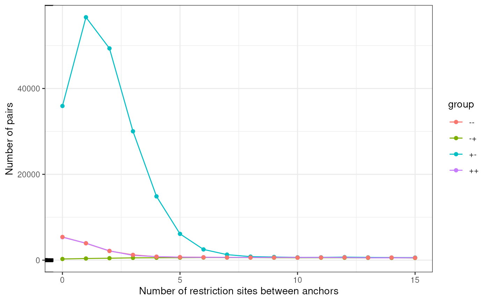
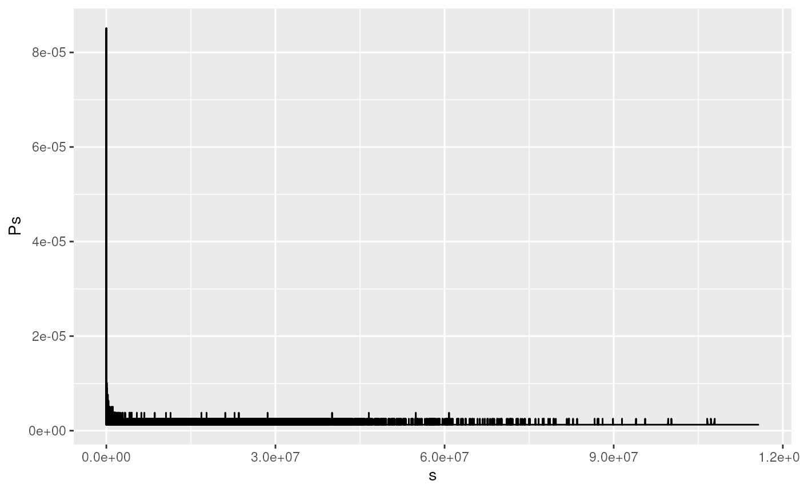
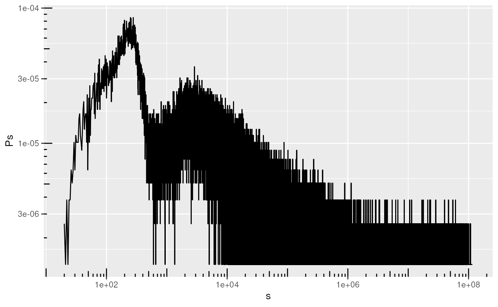
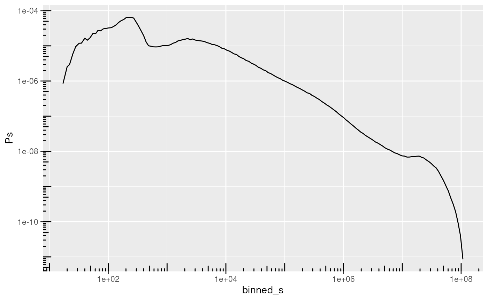
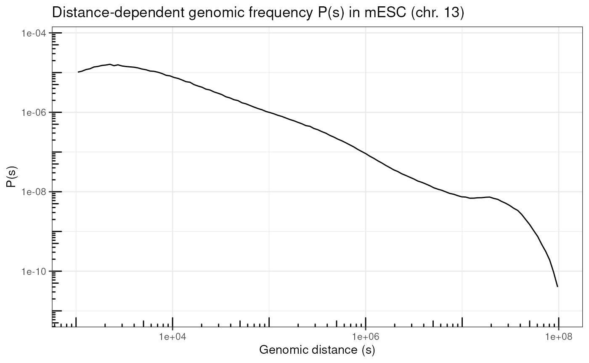

# Hi-C arithmetic with plyinteractions

The
*[plyinteractions](https://bioconductor.org/packages/3.24/plyinteractions)*
package facilitates data aggregation, for up to hundreds of thousands
and even millions of genomic interactions. In this vignette, we explore
several use cases which can arise when exploring Hi-C data stored in
`pairs` files.

We will use a real-life `pairs` file provided by the `4DN` Consortium.
This file has been generated from processing Hi-C performed in mouse
from brain cell primary culture during neural development (Bonev et al.,
Cell 2017). Pairs have been filtered to only those mapped over `chr13`.

\
[`library`](https://rdrr.io/r/base/library.html)`(`[`plyinteractions`](https://github.com/js2264/plyinteractions)`)`\
`#> Loading required package: InteractionSet`\
`#> Loading required package: GenomicRanges`\
`#> Loading required package: stats4`\
`#> Loading required package: BiocGenerics`\
`#> Loading required package: generics`\
`#> `\
`#> Attaching package: 'generics'`\
`#> The following objects are masked from 'package:base':`\
`#> `\
`#>     as.difftime, as.factor, as.ordered, intersect, is.element, setdiff, setequal, union`\
`#> `\
`#> Attaching package: 'BiocGenerics'`\
`#> The following objects are masked from 'package:stats':`\
`#> `\
`#>     IQR, mad, sd, var, xtabs`\
`#> The following object is masked from 'package:utils':`\
`#> `\
`#>     data`\
`#> The following objects are masked from 'package:base':`\
`#> `\
`#>     anyDuplicated, aperm, append, as.data.frame, basename, cbind, colnames, dirname, do.call, duplicated, eval, evalq, Filter, Find, get, grep, grepl, is.unsorted, lapply, Map, mapply, match, mget, order, paste, pmax, pmax.int, pmin, pmin.int, Position, rank, rbind, Reduce, rownames, sapply, saveRDS, scale, sequence, table, tapply, transform, unique, unsplit, which.max, which.min`\
`#> Loading required package: S4Vectors`\
`#> `\
`#> Attaching package: 'S4Vectors'`\
`#> The following object is masked from 'package:utils':`\
`#> `\
`#>     findMatches`\
`#> The following objects are masked from 'package:base':`\
`#> `\
`#>     expand.grid, I, unname`\
`#> Loading required package: IRanges`\
`#> Loading required package: Seqinfo`\
`#> Loading required package: SummarizedExperiment`\
`#> Loading required package: MatrixGenerics`\
`#> Loading required package: matrixStats`\
`#> `\
`#> Attaching package: 'MatrixGenerics'`\
`#> The following objects are masked from 'package:matrixStats':`\
`#> `\
`#>     colAlls, colAnyNAs, colAnys, colAvgsPerRowSet, colCollapse, colCounts, colCummaxs, colCummins, colCumprods, colCumsums, colDiffs, colIQRDiffs, colIQRs, colLogSumExps, colMadDiffs, colMads, colMaxs, colMeans2, colMedians, colMins, colOrderStats, colProds, colQuantiles, colRanges, colRanks, colSdDiffs, colSds, colSums2, colTabulates, colVarDiffs, colVars, colWeightedMads, colWeightedMeans, colWeightedMedians, colWeightedSds, colWeightedVars, rowAlls, rowAnyNAs, rowAnys, rowAvgsPerColSet, rowCollapse, rowCounts, rowCummaxs, rowCummins, rowCumprods, rowCumsums, rowDiffs, rowIQRDiffs, rowIQRs, rowLogSumExps, rowMadDiffs, rowMads, rowMaxs, rowMeans2, rowMedians, rowMins, rowOrderStats, rowProds, rowQuantiles, rowRanges, rowRanks, rowSdDiffs, rowSds, rowSums2, rowTabulates, rowVarDiffs, rowVars, rowWeightedMads, rowWeightedMeans, rowWeightedMedians, rowWeightedSds, rowWeightedVars`\
`#> Loading required package: Biobase`\
`#> Welcome to Bioconductor`\
`#> `\
`#>     Vignettes contain introductory material; view with 'browseVignettes()'. To cite Bioconductor, see 'citation("Biobase")', and for packages 'citation("pkgname")'.`\
`#> `\
`#> Attaching package: 'Biobase'`\
`#> The following object is masked from 'package:MatrixGenerics':`\
`#> `\
`#>     rowMedians`\
`#> The following objects are masked from 'package:matrixStats':`\
`#> `\
`#>     anyMissing, rowMedians`\
`#> Loading required package: plyranges`\
`#> Loading required package: dplyr`\
`#> `\
`#> Attaching package: 'dplyr'`\
`#> The following object is masked from 'package:Biobase':`\
`#> `\
`#>     combine`\
`#> The following object is masked from 'package:matrixStats':`\
`#> `\
`#>     count`\
`#> The following objects are masked from 'package:GenomicRanges':`\
`#> `\
`#>     intersect, setdiff, union`\
`#> The following object is masked from 'package:Seqinfo':`\
`#> `\
`#>     intersect`\
`#> The following objects are masked from 'package:IRanges':`\
`#> `\
`#>     collapse, desc, intersect, setdiff, slice, union`\
`#> The following objects are masked from 'package:S4Vectors':`\
`#> `\
`#>     first, intersect, rename, setdiff, setequal, union`\
`#> The following objects are masked from 'package:BiocGenerics':`\
`#> `\
`#>     combine, intersect, setdiff, setequal, union`\
`#> The following object is masked from 'package:generics':`\
`#> `\
`#>     explain`\
`#> The following objects are masked from 'package:stats':`\
`#> `\
`#>     filter, lag`\
`#> The following objects are masked from 'package:base':`\
`#> `\
`#>     intersect, setdiff, setequal, union`\
`#> `\
`#> Attaching package: 'plyranges'`\
`#> The following objects are masked from 'package:dplyr':`\
`#> `\
`#>     between, n, n_distinct`\
`#> `\
`#> Attaching package: 'plyinteractions'`\
`#> The following objects are masked from 'package:plyranges':`\
`#> `\
`#>     flank_downstream, flank_left, flank_right, flank_upstream, shift_downstream, shift_left, shift_right, shift_upstream`\
[`library`](https://rdrr.io/r/base/library.html)`(`[`tidyverse`](https://tidyverse.tidyverse.org)`)`\
`#> ── ``Attaching core tidyverse packages`` ─────────────────────────────────────────────────────────────────────────────────────────────────────────────────────────────────────────────────────────────────────────────────────────────────────────────────────────────────────────────────────────────────────────────────────────────────────────────────────────────────────────────────────────────────────────────────────────────────────────────────────────────────────────────────────────────────────────────────────────────────────────────────────────────────────────────────────────────────────────────────────────────────────────────────────────────────────────────────────────────────────────────────────────────────────────────────────────────────────────────────────────────────────────────────────────────────────────────────────────────────────────────────────────────────────────────────────────────────────────────────────────────────────────────────────────────────────────────────────────────────────────────────────────────────────────────────────────────────────────────────────────────────────────────────────────────────────────────────────────────────────────────────────────────────────────────────────────────────────────────────────────────────────────────────────────────────────────────────────────────────────────────────────────────────────────────────────────────────────────────────────────────────────────────────────────────────────────────────────────────────────────────────────────────────────────────────────────────────────────────────────────────────────────────────────────────────────────────────────────────────────────────────────────────────────────────────────────────────────────────────────────────────────────────────────────────────────────────────────────────────────────────────────────────────────────────────────────────────────────────────────────────────────────────────────────────────────────────────────────────────────────────────────────────────────────────────────────────────────────────────────────────────────────────────────────────────────────────────────────────────────────────────────────────────────────────────────────────────────────────────────────────────────────────────────────────────────────────────────────────────────────────────────────────────────────────────────────────────────────────────────────────────────────────────────────────────────────────────────────────────────────────────────────────────────────────────────────────────────────────────────────────────────────────────────────────────────────────────────────────────────────────────────────────────────────────────────────────────────────────────────────────────────────────────────────────────────────────────────────────────────────────────────────────────────────────────────────────────────────────────────────────────────────────────────────────────────────────────────────────────────────────────────────────────────────────────────────────────────────────────────────────────────────────────────────────────────────────────────────────────────────────────────────────────────────────────────────────────────────────────────────────────────────────────────────────────────────────────────────────────────────────────────────────────────────────────────────────────────────────────────────────────────────────────────────────────────────────────────────────────────────────────────────────────────────────────────────────────────────────────────────────────────────────────────────────────────────────────────────────────────────────────────────────────────────────────────────────────────────────────────────────────────────────────────────────────────────────────────────────────────────────────────────────────────────────────────────────────────────────────────────────────────────────────────────────────────────────────────────────────────────────────────────────────────────────────────────────────────────────────────────────────────────────────────────────────────────────────────────────────────────────────────────────────────────────────────────────────────────────────────────────────────────────────────────────────────────────────────────────────────────────────────────────────────────────────────────────────────────────────────────────────────────────────────────────────────────────────────────────────────────────────────────────────────────────────────────────────────────────────────────────────────────────────────────────────────────────────────────────────────────────────────────────────────────────────────────────────────────────────────────────────────────────────────────────────────────────────────────────────────────────────────────────────────────────────────────────────────────────────────────────────────────────────────────────────────────────────────────────────────────────────────────────────────────────────────────────────────────────────────────────────────────────────────────────────────────────────────────────────────────────────────────────────────────────────────────────────────────────────────────────────────────────────────────────────────────────────────────────────────────────────────────────────────────────────────────────────────────────────────────────────────────────────────────────────────────────────────────────────────────────────────────────────────────────────────────────────────────────────────────────────────────────────────────────────────────────────────────────────────────────────────────────────────────────────────────────────────────────────────────────────────────────────────────────────────────────────────────────────────────────────────────────────────────────────────────────────────────────────────────────────────────────────────────────────────────────────────────────────────────────────────────────────────────────────────────────────────────────────────────────────────────────────────────────────────────────────────────────────────────────────────────────────────────────────────────────────────────────────────────────────────────────────────────────────────────────────────────────────────────────────────────────────────────────────────────────────────────────────────────────────────────────────────────────────────────────────────────────────────────────────────────────────────────────────────────────────────────────────────────────────────────────────────────────────────────────────────────────────────────────────────────────────────────────────────────────────────────────────────────────────────────────────────────────────────────────────────────────────────────────────────────────────────────────────────────────────────────────────────────────────────────────────────────────────────────────────────────────────────────────────────────────────────────────────────────────────────────────────────────────────────────────────────────────────────────────────────────────────────────────────────────────────────────────────────────────────────────────────────────────────────────────────────────────────────────────────────────────────────────────────────────────────────────────────────────────────────────────────────────────────────────────────────────────────────────────────────────────────────────────────────────────────────────────────────────────────────────────────────────────────────────────────────────────────────────────────────────────────────────────────────────────────────────────────────────────────────────────────────────────────────────────────────────────────────────────────────────────────────────────────────────────────────────────────────────────────────────────────────────────────────────────────────────────────────────────────────────────────────────────────────────────────────────────────────────────────────────────────────────────────────────────────────────────────────────────────────────────────────────────────────────────────────────────────────────────────────────────────────────────────────────────────────────────────────────────────────────────────────────────────────────────────────────────────────────────────────────────────────────────────────────────────────────────────────────────────────────────────────────────────────────────────────────────────────────────────────────────────────────────────────────────────────────────────────────────────────────────────────────────────────────────────────────────────────────────────────────────────────────────────────────────────────────────────────────────────────────────────────────────────────────────────────────────────────────────────────────────────────────────────────────────────────────────────────────────────────────────────────────────────────────────────────────────────────────────────────────────────────────────────────────────────────────────────────────────────────────────────────────────────────────────────────────────────────────────────────────────────────────────────────────────────────────────────────────────────────────────────────────────────────────────────────────────────────────────────────────────────────────────────────────────────────────────────────────────────────────────────────────────────────────────────────────────────────────────────────────────────────────────────────────────────────────────────────────────────────────────────────────────────────────────────────────────────────────────────────────────────────────────────────────────────────────────────────────────────────────────────────────────────────────────────────────────────────────────────────────────────────────────────────────────────────────────────────────────────────────────────────────────────────────────────────────────────────────────────────────────────────────────────────────────────────────────────────────────────────────────────────────────────────────────────────────────────────────────────────────────────────────────────────────────────────────────────────────────────────────────────────────────────────── tidyverse 2.0.0 ──`\
`#> ``✔`` ``forcats  `` 1.0.1     ``✔`` ``readr    `` 2.2.0`\
`#> ``✔`` ``ggplot2  `` 4.0.3     ``✔`` ``stringr  `` 1.6.0`\
`#> ``✔`` ``lubridate`` 1.9.5     ``✔`` ``tibble   `` 3.3.1`\
`#> ``✔`` ``purrr    `` 1.2.2     ``✔`` ``tidyr    `` 1.3.2`\
`#> ── ``Conflicts`` ───────────────────────────────────────────────────────────────────────────────────────────────────────────────────────────────────────────────────────────────────────────────────────────────────────────────────────────────────────────────────────────────────────────────────────────────────────────────────────────────────────────────────────────────────────────────────────────────────────────────────────────────────────────────────────────────────────────────────────────────────────────────────────────────────────────────────────────────────────────────────────────────────────────────────────────────────────────────────────────────────────────────────────────────────────────────────────────────────────────────────────────────────────────────────────────────────────────────────────────────────────────────────────────────────────────────────────────────────────────────────────────────────────────────────────────────────────────────────────────────────────────────────────────────────────────────────────────────────────────────────────────────────────────────────────────────────────────────────────────────────────────────────────────────────────────────────────────────────────────────────────────────────────────────────────────────────────────────────────────────────────────────────────────────────────────────────────────────────────────────────────────────────────────────────────────────────────────────────────────────────────────────────────────────────────────────────────────────────────────────────────────────────────────────────────────────────────────────────────────────────────────────────────────────────────────────────────────────────────────────────────────────────────────────────────────────────────────────────────────────────────────────────────────────────────────────────────────────────────────────────────────────────────────────────────────────────────────────────────────────────────────────────────────────────────────────────────────────────────────────────────────────────────────────────────────────────────────────────────────────────────────────────────────────────────────────────────────────────────────────────────────────────────────────────────────────────────────────────────────────────────────────────────────────────────────────────────────────────────────────────────────────────────────────────────────────────────────────────────────────────────────────────────────────────────────────────────────────────────────────────────────────────────────────────────────────────────────────────────────────────────────────────────────────────────────────────────────────────────────────────────────────────────────────────────────────────────────────────────────────────────────────────────────────────────────────────────────────────────────────────────────────────────────────────────────────────────────────────────────────────────────────────────────────────────────────────────────────────────────────────────────────────────────────────────────────────────────────────────────────────────────────────────────────────────────────────────────────────────────────────────────────────────────────────────────────────────────────────────────────────────────────────────────────────────────────────────────────────────────────────────────────────────────────────────────────────────────────────────────────────────────────────────────────────────────────────────────────────────────────────────────────────────────────────────────────────────────────────────────────────────────────────────────────────────────────────────────────────────────────────────────────────────────────────────────────────────────────────────────────────────────────────────────────────────────────────────────────────────────────────────────────────────────────────────────────────────────────────────────────────────────────────────────────────────────────────────────────────────────────────────────────────────────────────────────────────────────────────────────────────────────────────────────────────────────────────────────────────────────────────────────────────────────────────────────────────────────────────────────────────────────────────────────────────────────────────────────────────────────────────────────────────────────────────────────────────────────────────────────────────────────────────────────────────────────────────────────────────────────────────────────────────────────────────────────────────────────────────────────────────────────────────────────────────────────────────────────────────────────────────────────────────────────────────────────────────────────────────────────────────────────────────────────────────────────────────────────────────────────────────────────────────────────────────────────────────────────────────────────────────────────────────────────────────────────────────────────────────────────────────────────────────────────────────────────────────────────────────────────────────────────────────────────────────────────────────────────────────────────────────────────────────────────────────────────────────────────────────────────────────────────────────────────────────────────────────────────────────────────────────────────────────────────────────────────────────────────────────────────────────────────────────────────────────────────────────────────────────────────────────────────────────────────────────────────────────────────────────────────────────────────────────────────────────────────────────────────────────────────────────────────────────────────────────────────────────────────────────────────────────────────────────────────────────────────────────────────────────────────────────────────────────────────────────────────────────────────────────────────────────────────────────────────────────────────────────────────────────────────────────────────────────────────────────────────────────────────────────────────────────────────────────────────────────────────────────────────────────────────────────────────────────────────────────────────────────────────────────────────────────────────────────────────────────────────────────────────────────────────────────────────────────────────────────────────────────────────────────────────────────────────────────────────────────────────────────────────────────────────────────────────────────────────────────────────────────────────────────────────────────────────────────────────────────────────────────────────────────────────────────────────────────────────────────────────────────────────────────────────────────────────────────────────────────────────────────────────────────────────────────────────────────────────────────────────────────────────────────────────────────────────────────────────────────────────────────────────────────────────────────────────────────────────────────────────────────────────────────────────────────────────────────────────────────────────────────────────────────────────────────────────────────────────────────────────────────────────────────────────────────────────────────────────────────────────────────────────────────────────────────────────────────────────────────────────────────────────────────────────────────────────────────────────────────────────────────────────────────────────────────────────────────────────────────────────────────────────────────────────────────────────────────────────────────────────────────────────────────────────────────────────────────────────────────────────────────────────────────────────────────────────────────────────────────────────────────────────────────────────────────────────────────────────────────────────────────────────────────────────────────────────────────────────────────────────────────────────────────────────────────────────────────────────────────────────────────────────────────────────────────────────────────────────────────────────────────────────────────────────────────────────────────────────────────────────────────────────────────────────────────────────────────────────────────────────────────────────────────────────────────────────────────────────────────────────────────────────────────────────────────────────────────────────────────────────────────────────────────────────────────────────────────────────────────────────────────────────────────────────────────────────────────────────────────────────────────────────────────────────────────────────────────────────────────────────────────────────────────────────────────────────────────────────────────────────────────────────────────────────────────────────────────────────────────────────────────────────────────────────────────────────────────────────────────────────────────────────────────────────────────────────────────────────────────────────────────────────────────────────────────────────────────────────────────────────────────────────────────────────────────────────────────────────────────────────────────────────────────────────────────────────────────────────────────────────────────────────────────────────────────────────────────────────────────────────────────────────────────────────────────────────────────────────────────────────────────────────────────────────────────────────────────────────────────────────────────────────────────────────────────────────────────────────────────────────────────────────────────────────────────────────────────────────────────────────────────────────────────────────────────────────────────────────────────────────────────────────────────────────────────────────────────────────────────────────────────────────────────────────────────────────────────────────────────────────────────────────────────────────────────────────────────────────────────────────────────────────────────────────────────────────────────────────────────────────────────────────────────────────────────────────────────────────────────────────────────────────────────────────────────────────────────────────────────────── tidyverse_conflicts() ──`\
`#> ``✖`` ``lubridate``::``%within%()``   masks ``IRanges``::%within%()`\
`#> ``✖`` ``ggplot2``::``annotate()``     masks ``plyinteractions``::annotate()`\
`#> ``✖`` ``plyranges``::``between()``    masks ``dplyr``::between()`\
`#> ``✖`` ``dplyr``::``collapse()``       masks ``IRanges``::collapse()`\
`#> ``✖`` ``dplyr``::``combine()``        masks ``Biobase``::combine(), ``BiocGenerics``::combine()`\
`#> ``✖`` ``dplyr``::``count()``          masks ``matrixStats``::count()`\
`#> ``✖`` ``dplyr``::``desc()``           masks ``IRanges``::desc()`\
`#> ``✖`` ``tidyr``::``expand()``         masks ``S4Vectors``::expand()`\
`#> ``✖`` ``dplyr``::``filter()``         masks ``stats``::filter()`\
`#> ``✖`` ``dplyr``::``first()``          masks ``S4Vectors``::first()`\
`#> ``✖`` ``dplyr``::``lag()``            masks ``stats``::lag()`\
`#> ``✖`` ``plyranges``::``n()``          masks ``dplyr``::n()`\
`#> ``✖`` ``plyranges``::``n_distinct()`` masks ``dplyr``::n_distinct()`\
`#> ``✖`` ``ggplot2``::``Position()``     masks ``BiocGenerics``::Position(), ``base``::Position()`\
`#> ``✖`` ``purrr``::``reduce()``         masks ``GenomicRanges``::reduce(), ``IRanges``::reduce()`\
`#> ``✖`` ``dplyr``::``rename()``         masks ``S4Vectors``::rename()`\
`#> ``✖`` ``lubridate``::``second()``     masks ``S4Vectors``::second()`\
`#> ``✖`` ``lubridate``::``second<-()``   masks ``S4Vectors``::second<-()`\
`#> ``✖`` ``dplyr``::``slice()``          masks ``IRanges``::slice()`\
`#> ``ℹ`` Use the conflicted package (``<http://conflicted.r-lib.org/>``) to force all conflicts to become errors`\
\
`## Importing it in R`\
`pairs_file`` ``<-`` ``HiContactsData``::`[`HiContactsData`](https://rdrr.io/pkg/HiContactsData/man/HiContactsData.html)`(``'mESCs'``, ``'pairs.gz'``)`\
`#> see ?HiContactsData and browseVignettes('HiContactsData') for documentation`\
`#> loading from cache`\
`pairs_df`` ``<-`` `[`read.delim`](https://rdrr.io/r/utils/read.table.html)`(`\
`    ``pairs_file``, sep ``=`` ``"\t"``, header ``=`` ``FALSE``, comment.char ``=`` ``"#"``, nrows ``=`` ``1e6`\
`)`` ``|>`` `\
`    `[`set_names`](https://rlang.r-lib.org/reference/set_names.html)`(`[`c`](https://rdrr.io/r/base/c.html)`(`\
`        ``"ID"``, ``"seqnames1"``, ``"start1"``, `\
`        ``"seqnames2"``, ``"start2"``, ``"strand1"``, ``"strand2"`\
`    ``)``)`` `\
`pairs`` ``<-`` `[`as_ginteractions`](../reference/ginteractions-construct.md)`(`\
`    ``pairs_df``, end1 ``=`` ``start1``, end2 ``=`` ``start2``, keep.extra.columns ``=`` ``TRUE`\
`)`\
`pairs`\
`#> GInteractions object with 1000000 interactions and 1 metadata column:`\
`#>             seqnames1   ranges1 strand1     seqnames2   ranges2 strand2 |                  ID`\
`#>                 <Rle> <IRanges>   <Rle>         <Rle> <IRanges>   <Rle> |         <character>`\
`#>         [1]     chr13  17057558       + ---     chr13  17176616       - |       SRR5339749.58`\
`#>         [2]     chr13  68759440       - ---     chr13 113578864       - |      SRR5339749.105`\
`#>         [3]     chr13  47940999       + ---     chr13  48134537       + |      SRR5339749.169`\
`#>         [4]     chr13  80638451       + ---     chr13  80638826       - |      SRR5339749.170`\
`#>         [5]     chr13   4362498       - ---     chr13  96982617       + |      SRR5339749.249`\
`#>         ...       ...       ...     ... ...       ...       ...     ... .                 ...`\
`#>    [999996]     chr13  17722638       - ---     chr13  20561010       - | SRR5339749.45907723`\
`#>    [999997]     chr13  91988792       + ---     chr13  92333140       - | SRR5339749.45907730`\
`#>    [999998]     chr13  98284294       - ---     chr13  98531510       + | SRR5339749.45907742`\
`#>    [999999]     chr13  36053113       + ---     chr13  36076689       - | SRR5339749.45907855`\
`#>   [1000000]     chr13  25585835       + ---     chr13  26197381       - | SRR5339749.45907876`\
`#>   -------`\
`#>   regions: 1936743 ranges and 0 metadata columns`\
`#>   seqinfo: 1 sequence from an unspecified genome; no seqlengths`

## Estimating pairs filtering thresholds

We can first *in silico* digest the mouse genome to obtain the
coordinates of each genomic fragment after digestion by **DpnII and
HinfI**.

\
`## Prepare DpnII/HinfI-digested genomic fragments`\
[`library`](https://rdrr.io/r/base/library.html)`(`[`Biostrings`](https://bioconductor.org/packages/Biostrings)`)`\
`#> Loading required package: XVector`\
`#> `\
`#> Attaching package: 'XVector'`\
`#> The following object is masked from 'package:purrr':`\
`#> `\
`#>     compact`\
`#> `\
`#> Attaching package: 'Biostrings'`\
`#> The following object is masked from 'package:base':`\
`#> `\
`#>     strsplit`\
`genome`` ``<-`` ``BSgenome.Mmusculus.UCSC.mm10``::`[`BSgenome.Mmusculus.UCSC.mm10`](https://rdrr.io/pkg/BSgenome.Mmusculus.UCSC.mm10/man/package.html)\
`cutter`` ``<-`` `[`DNAStringSet`](https://rdrr.io/pkg/Biostrings/man/XStringSet-class.html)`(`[`c`](https://rdrr.io/r/base/c.html)`(``"GATC"``, ``"GANTC"``)``)``  ``## DpnII/HinfI cutting site`\
`fragments`` ``<-`` ``BiocParallel``::`[`bplapply`](https://rdrr.io/pkg/BiocParallel/man/bplapply.html)`(``BPPARAM ``=`` ``BiocParallel``::`[`MulticoreParam`](https://rdrr.io/pkg/BiocParallel/man/MulticoreParam-class.html)`(``workers ``=`` ``2``)``, `\
`    `[`names`](https://rdrr.io/r/base/names.html)`(``genome``)``, ``function``(``.x``)`` ``{`\
`        ``seq`` ``<-`` ``genome``[[``.x``]``]`\
`        ``mids`` ``<-`` `[`lapply`](https://rdrr.io/pkg/BiocGenerics/man/lapply.html)`(`\
`            ``cutter``, `\
`            ``function``(``cutsite``)`` ``{`\
`                ``hits`` ``<-`` `[`matchPattern`](https://rdrr.io/pkg/Biostrings/man/matchPattern.html)`(``cutsite``, ``seq``, fixed ``=`` ``"subject"``)`\
`                `[`start`](https://rdrr.io/r/stats/start.html)`(``hits``)`` ``+`` ``{`[`end`](https://rdrr.io/r/stats/start.html)`(``hits``)`` ``-`` `[`start`](https://rdrr.io/r/stats/start.html)`(``hits``)``}`\
`            ``}`\
`        ``)`` ``|>`` `[`unlist`](https://rdrr.io/pkg/BiocGenerics/man/unlist.html)`(``)`` ``|>`` `[`sort`](https://rdrr.io/pkg/BiocGenerics/man/sort.html)`(``)`\
`        `[`GRanges`](https://rdrr.io/pkg/GenomicRanges/man/GRanges-class.html)`(``seqnames ``=`` ``.x``, `[`IRanges`](https://rdrr.io/pkg/IRanges/man/IRanges-constructor.html)`(`\
`            start ``=`` `[`c`](https://rdrr.io/r/base/c.html)`(``1``, ``mids``)``, end ``=`` `[`c`](https://rdrr.io/r/base/c.html)`(``mids``-``1``, `[`length`](https://rdrr.io/r/base/length.html)`(``seq``)``)`\
`        ``)``)`\
`    ``}`\
`)`` ``|>`` `\
`    `[`set_names`](https://rlang.r-lib.org/reference/set_names.html)`(`[`names`](https://rdrr.io/r/base/names.html)`(``genome``)``)`` ``|>`` `\
`    `[`GRangesList`](https://rdrr.io/pkg/GenomicRanges/man/GRangesList-class.html)`(``)`` ``|>`` `\
`    `[`unlist`](https://rdrr.io/pkg/BiocGenerics/man/unlist.html)`(``)`\
`fragments``$``binID`` ``<-`` `[`seq_along`](https://rdrr.io/r/base/seq.html)`(``fragments``)`

We can then use the
[`annotate()`](../reference/ginteractions-annotate.md) function from
*[plyinteractions](https://bioconductor.org/packages/3.24/plyinteractions)*
to recover, for each interaction, which restriction enzyme fragment each
anchor overlaps with, and how many restriction enzyme cutting sites are
found between them.

\
`## Annotate for each anchor set which genomic fragment it overlaps with`\
`annotated_pairs`` ``<-`` ``pairs`` ``|>`` `\
`    ``plyinteractions``::`[`annotate`](../reference/ginteractions-annotate.md)`(``fragments``, by ``=`` ``"binID"``)`` ``|>`` `\
`    `[`mutate`](https://dplyr.tidyverse.org/reference/mutate.html)`(``n_fragments ``=`` ``binID.2`` ``-`` ``binID.1``, group ``=`` `[`paste0`](https://rdrr.io/r/base/paste.html)`(``strand1``, ``strand2``)``)`\
`annotated_pairs`\
`#> GInteractions object with 1000000 interactions and 5 metadata columns:`\
`#>             seqnames1   ranges1 strand1     seqnames2   ranges2 strand2 |                  ID   binID.1   binID.2 n_fragments       group`\
`#>                 <Rle> <IRanges>   <Rle>         <Rle> <IRanges>   <Rle> |         <character> <integer> <integer>   <integer> <character>`\
`#>         [1]     chr13  17057558       + ---     chr13  17176616       - |       SRR5339749.58   9591352   9592012         660          +-`\
`#>         [2]     chr13  68759440       - ---     chr13 113578864       - |      SRR5339749.105   9880169  10124404      244235          --`\
`#>         [3]     chr13  47940999       + ---     chr13  48134537       + |      SRR5339749.169   9762274   9763393        1119          ++`\
`#>         [4]     chr13  80638451       + ---     chr13  80638826       - |      SRR5339749.170   9946878   9946878           0          +-`\
`#>         [5]     chr13   4362498       - ---     chr13  96982617       + |      SRR5339749.249   9521271  10034142      512871          -+`\
`#>         ...       ...       ...     ... ...       ...       ...     ... .                 ...       ...       ...         ...         ...`\
`#>    [999996]     chr13  17722638       - ---     chr13  20561010       - | SRR5339749.45907723   9594967   9610226       15259          --`\
`#>    [999997]     chr13  91988792       + ---     chr13  92333140       - | SRR5339749.45907730  10007449  10009172        1723          +-`\
`#>    [999998]     chr13  98284294       - ---     chr13  98531510       + | SRR5339749.45907742  10041410  10042771        1361          -+`\
`#>    [999999]     chr13  36053113       + ---     chr13  36076689       - | SRR5339749.45907855   9696787   9696912         125          +-`\
`#>   [1000000]     chr13  25585835       + ---     chr13  26197381       - | SRR5339749.45907876   9638511   9641687        3176          +-`\
`#>   -------`\
`#>   regions: 1936743 ranges and 0 metadata columns`\
`#>   seqinfo: 1 sequence from an unspecified genome; no seqlengths`

Next, we can plot the distribution of `strand1` and `strand2`
cominations as a function of the number of restriction enzyme cutting
sites between anchors of each interaction.

\
`df`` ``<-`` ``annotated_pairs`` ``|>`` `\
`    `[`head`](https://rdrr.io/r/utils/head.html)`(``n ``=`` ``1e6``)`` ``|>`` `\
`    `[`group_by`](https://dplyr.tidyverse.org/reference/group_by.html)`(``strand1``, ``strand2``, ``n_fragments``)`` ``|>`` `\
`    `[`count`](https://dplyr.tidyverse.org/reference/count.html)`(``)`` ``|>`` `\
`    `[`as_tibble`](https://tibble.tidyverse.org/reference/as_tibble.html)`(``)`` ``|>`` `\
`    `[`mutate`](https://dplyr.tidyverse.org/reference/mutate.html)`(``group ``=`` `[`paste0`](https://rdrr.io/r/base/paste.html)`(``strand1``, ``strand2``)``)`` ``|>`` `\
`    `[`select`](https://dplyr.tidyverse.org/reference/select.html)`(``group``, ``n_fragments``, ``n``)`\
[`ggplot`](https://ggplot2.tidyverse.org/reference/ggplot.html)`(``df``, `[`aes`](https://ggplot2.tidyverse.org/reference/aes.html)`(``x ``=`` ``n_fragments``, y ``=`` ``n``, group ``=`` ``group``, col ``=`` ``group``)``)`` ``+`` `\
`    `[`geom_line`](https://ggplot2.tidyverse.org/reference/geom_path.html)`(``)`` ``+`` `\
`    `[`geom_point`](https://ggplot2.tidyverse.org/reference/geom_point.html)`(``)`` ``+`` `\
`    `[`xlim`](https://ggplot2.tidyverse.org/reference/lims.html)`(`[`c`](https://rdrr.io/r/base/c.html)`(``0``, ``15``)``)`` ``+`` `\
`    `[`annotation_logticks`](https://ggplot2.tidyverse.org/reference/annotation_logticks.html)`(``sides ``=`` ``'l'``)`` ``+`` `\
`    `[`theme_bw`](https://ggplot2.tidyverse.org/reference/ggtheme.html)`(``)`` ``+`` `\
`    `[`labs`](https://ggplot2.tidyverse.org/reference/labs.html)`(`\
`        x ``=`` ``"Number of restriction sites between anchors"``, `\
`        y ``=`` ``"Number of pairs"`\
`    ``)`\
`` #> Warning: Removed 267493 rows containing missing values or values outside the scale range (`geom_line()`). ``\
`` #> Warning: Removed 267493 rows containing missing values or values outside the scale range (`geom_point()`). ``

From this distribution, we can see that `--` and `++` pairs have a
decreasing frequency over increasing numbers of cut sites between
anchors of each interaction. These pairs are unambiguous, as the
orientation of each sequenced end can only come from true cutting and
religation event, (except the set of `--` and `++` pairs which have `0`
cut sites between each anchor, which cannot be explained); all these
pairs can be kept.

The over-representation of `+-` pairs at short distance likely represent
uncut fragments subsequently sequenced on each end. The
under-representation of `-+` pairs at short distance likely represent
self-religated fragments. We can estimate a threshold for each of these
pairs sets by computing the MAD and expected , as described in [Cournac
et al.,
2012](https://bmcgenomics.biomedcentral.com/articles/10.1186/1471-2164-13-436).

\
`filters`` ``<-`` ``df`` ``|>`` `\
`    `[`filter`](https://dplyr.tidyverse.org/reference/filter.html)`(``n_fragments`` ``<=`` ``50``)`` ``|>`` `\
`    `[`arrange`](https://dplyr.tidyverse.org/reference/arrange.html)`(``n_fragments``)`` ``|>`` `\
`    `[`group_by`](https://dplyr.tidyverse.org/reference/group_by.html)`(``n_fragments``)`` ``|>`` `\
`    `[`mutate`](https://dplyr.tidyverse.org/reference/mutate.html)`(``median ``=`` `[`median`](https://rdrr.io/r/stats/median.html)`(``n``)``)`` ``|>`` `\
`    `[`ungroup`](https://dplyr.tidyverse.org/reference/group_by.html)`(``)`` ``|>`` `\
`    `[`mutate`](https://dplyr.tidyverse.org/reference/mutate.html)`(``MAD ``=`` `[`median`](https://rdrr.io/r/stats/median.html)`(`[`abs`](https://rdrr.io/r/base/MathFun.html)`(``n`` ``-`` ``median``)``)``)`` ``|>`` `\
`    `[`mutate`](https://dplyr.tidyverse.org/reference/mutate.html)`(``withinMAD ``=`` `[`abs`](https://rdrr.io/r/base/MathFun.html)`(``n`` ``-`` ``median``)`` ``<=`` ``MAD`` ``/`` ``0.67449``)`` ``|>`` `\
`    `[`filter`](https://dplyr.tidyverse.org/reference/filter.html)`(``withinMAD``)`` ``|>`` `\
`    `[`slice_head`](https://dplyr.tidyverse.org/reference/slice.html)`(``by ``=`` ``group``, n ``=`` ``1``)`` ``|>`` `\
`    `[`select`](https://dplyr.tidyverse.org/reference/select.html)`(``group``, ``n_fragments``)`` ``|>`` `\
`    `[`rename`](https://rdrr.io/pkg/S4Vectors/man/Vector-class.html)`(``threshold ``=`` ``n_fragments``)`\
`filters`\
`#> ``# A tibble: 4 × 2`\
`#>   group threshold`\
`#>   ``<chr>``     ``<int>`\
`#> ``1`` ++            1`\
`#> ``2`` --            1`\
`#> ``3`` -+            8`\
`#> ``4`` +-           10`

## Filtering pairs using appropriate thresholds

\
`annotated_pairs`` ``<-`` ``annotated_pairs`` ``|>`` `\
`    `[`mutate`](https://dplyr.tidyverse.org/reference/mutate.html)`(``threshold ``=`` `[`left_join`](https://dplyr.tidyverse.org/reference/mutate-joins.html)`(`[`as_tibble`](https://tibble.tidyverse.org/reference/as_tibble.html)`(`[`mcols`](https://rdrr.io/pkg/S4Vectors/man/Vector-class.html)`(``annotated_pairs``)``)``, ``filters``)``$``threshold``)`` ``|>`` `\
`    `[`mutate`](https://dplyr.tidyverse.org/reference/mutate.html)`(``type ``=`` `[`case_when`](https://dplyr.tidyverse.org/reference/case-and-replace-when.html)`(`\
`        ``group`` `[`%in%`](https://rdrr.io/pkg/BiocGenerics/man/match.html)` `[`c`](https://rdrr.io/r/base/c.html)`(``'--'``, ``'++'``)`` ``&`` ``n_fragments`` ``<`` ``threshold`` ``~`` ``"excluded"``, `\
`        ``group`` ``==`` ``'+-'`` ``&`` ``n_fragments`` ``<`` ``threshold`` ``~`` ``"uncut"``, `\
`        ``group`` ``==`` ``'-+'`` ``&`` ``n_fragments`` ``<`` ``threshold`` ``~`` ``"religated"``, `\
`        .default ``=`` ``"kept"`\
`    ``)``)`\
`` #> Joining with `by = join_by(group)` ``\
[`mcols`](https://rdrr.io/pkg/S4Vectors/man/Vector-class.html)`(``annotated_pairs``)`` ``|>`\
`    `[`as_tibble`](https://tibble.tidyverse.org/reference/as_tibble.html)`(``)`` ``|>`` `\
`    `[`count`](https://dplyr.tidyverse.org/reference/count.html)`(``type``)`` ``|>`` `\
`    `[`mutate`](https://dplyr.tidyverse.org/reference/mutate.html)`(``n ``=`` ``scales``::`[`percent`](https://scales.r-lib.org/reference/percent_format.html)`(``n``/`[`sum`](https://rdrr.io/r/base/sum.html)`(``n``)``)``)`\
`#> ``# A tibble: 4 × 2`\
`#>   type      n     `\
`#>   ``<chr>``     ``<chr>`` `\
`#> ``1`` excluded  1.08% `\
`#> ``2`` kept      78.70%`\
`#> ``3`` religated 0.40% `\
`#> ``4`` uncut     19.82%`\
\
`filtered_pairs`` ``<-`` `[`filter`](https://dplyr.tidyverse.org/reference/filter.html)`(``annotated_pairs``, ``type`` ``==`` ``'kept'``)`

## Computing distance law from pairs

Another typical step when analyzing Hi-C processed data is the modeling
of a so-called “distance law”, (a.k.a “P(s)”), which describes the
genomic distance-dependent contact frequency between pairs of genomic
loci from a Hi-C experiment.

We can easily recover the distance between the two anchors of each
interaction (noted *s*) and plot the interaction frequency (noted
*P(s)*) as a function of this genomic distance.

### Plotting distance law: first try

\
`dat`` ``<-`` ``filtered_pairs`` ``|>`` `\
`    `[`mutate`](https://dplyr.tidyverse.org/reference/mutate.html)`(``s ``=`` `[`abs`](https://rdrr.io/r/base/MathFun.html)`(``end2`` ``-`` ``start1``)``)`` ``|>`` `\
`    `[`group_by`](https://dplyr.tidyverse.org/reference/group_by.html)`(``s``)`` ``|>`` `\
`    `[`count`](https://dplyr.tidyverse.org/reference/count.html)`(``name ``=`` ``"n"``)`` ``|>`\
`    `[`as_tibble`](https://tibble.tidyverse.org/reference/as_tibble.html)`(``)`` ``|>`` `\
`    `[`mutate`](https://dplyr.tidyverse.org/reference/mutate.html)`(``Ps ``=`` ``n``/`[`sum`](https://rdrr.io/r/base/sum.html)`(``n``)``)`` `\
`p`` ``<-`` `[`ggplot`](https://ggplot2.tidyverse.org/reference/ggplot.html)`(``dat``, `[`aes`](https://ggplot2.tidyverse.org/reference/aes.html)`(``x ``=`` ``s``, y ``=`` ``Ps``)``)`` ``+`` `[`geom_line`](https://ggplot2.tidyverse.org/reference/geom_path.html)`(``)`\
`p`

This is not very informative, as the distances span several orders of
magnitude in both dimensions.

### Second try: switching to logarithmic scale

Switching to a `log` scale in
*[ggplot2](https://CRAN.R-project.org/package=ggplot2)* is very easy.

\
`p`` ``+`` `[`scale_x_log10`](https://ggplot2.tidyverse.org/reference/scale_continuous.html)`(``)`` ``+`` `[`scale_y_log10`](https://ggplot2.tidyverse.org/reference/scale_continuous.html)`(``)`` ``+`` `[`annotation_logticks`](https://ggplot2.tidyverse.org/reference/annotation_logticks.html)`(``)`

### Third try: aggregating data before plotting

The previous P(s) plot is precise at the base-pair resolution. We can
aggregate counts by binned distances:

\
`# Calculate distance breaks evenly spaced on a log scale (base 1.1)`\
`x`` ``<-`` ``1.1``^``(``1``:``200``-``1``)`\
`lmc`` ``<-`` `[`coef`](https://rdrr.io/r/stats/coef.html)`(`[`lm`](https://rdrr.io/r/stats/lm.html)`(`[`c`](https://rdrr.io/r/base/c.html)`(``1``,``1161443398``)``~`[`c`](https://rdrr.io/r/base/c.html)`(``x``[``1``]``, ``x``[``200``]``)``)``)`\
`bins_breaks`` ``<-`` `[`unique`](https://rdrr.io/pkg/BiocGenerics/man/unique.html)`(`[`round`](https://rdrr.io/r/base/Round.html)`(``lmc``[``2``]``*``x`` ``+`` ``lmc``[``1``]``)``)`\
`bins_widths`` ``<-`` `[`lead`](https://dplyr.tidyverse.org/reference/lead-lag.html)`(``bins_breaks``)`` ``-`` ``bins_breaks`\
\
`# Bin distances`\
`dat`` ``<-`` ``filtered_pairs`` ``|>`` `\
`    `[`mutate`](https://dplyr.tidyverse.org/reference/mutate.html)`(``s ``=`` `[`abs`](https://rdrr.io/r/base/MathFun.html)`(``end2`` ``-`` ``start1``)``)`` ``|>`` `\
`    `[`mutate`](https://dplyr.tidyverse.org/reference/mutate.html)`(`\
`        binned_s ``=`` ``bins_breaks``[`[`as.numeric`](https://rdrr.io/r/base/numeric.html)`(`[`cut`](https://rdrr.io/r/base/cut.html)`(``s``, ``bins_breaks``)``)``]``, `\
`        bin_width ``=`` ``bins_widths``[`[`as.numeric`](https://rdrr.io/r/base/numeric.html)`(`[`cut`](https://rdrr.io/r/base/cut.html)`(``s``, ``bins_breaks``)``)``]`\
`    ``)`` ``|>`` `\
`    `[`group_by`](https://dplyr.tidyverse.org/reference/group_by.html)`(``binned_s``, ``bin_width``)`` ``|>`` `\
`    `[`count`](https://dplyr.tidyverse.org/reference/count.html)`(``name ``=`` ``"n"``)`` ``|>`\
`    `[`as_tibble`](https://tibble.tidyverse.org/reference/as_tibble.html)`(``)`` ``|>`` `\
`    `[`mutate`](https://dplyr.tidyverse.org/reference/mutate.html)`(``Ps ``=`` ``n`` ``/`` `[`sum`](https://rdrr.io/r/base/sum.html)`(``n``)`` ``/`` ``bin_width``)`\
\
`# Plot results`\
[`ggplot`](https://ggplot2.tidyverse.org/reference/ggplot.html)`(``dat``, `[`aes`](https://ggplot2.tidyverse.org/reference/aes.html)`(``x ``=`` ``binned_s``, y ``=`` ``Ps``)``)`` ``+`` `[`geom_line`](https://ggplot2.tidyverse.org/reference/geom_path.html)`(``)`` ``+`` `\
`    `[`scale_x_log10`](https://ggplot2.tidyverse.org/reference/scale_continuous.html)`(``)`` ``+`` `[`scale_y_log10`](https://ggplot2.tidyverse.org/reference/scale_continuous.html)`(``)`` ``+`` `[`annotation_logticks`](https://ggplot2.tidyverse.org/reference/annotation_logticks.html)`(``)`

### With some polishing

\
[`ggplot`](https://ggplot2.tidyverse.org/reference/ggplot.html)`(``dat``, `[`aes`](https://ggplot2.tidyverse.org/reference/aes.html)`(``x ``=`` ``binned_s``, y ``=`` ``Ps``)``)`` ``+`` `\
`    `[`geom_line`](https://ggplot2.tidyverse.org/reference/geom_path.html)`(``)`` ``+`` `\
`    `[`scale_x_log10`](https://ggplot2.tidyverse.org/reference/scale_continuous.html)`(``limits ``=`` `[`c`](https://rdrr.io/r/base/c.html)`(``1e3``, ``1e8``)``)`` ``+``    ``## This changes x axis to log scale`\
`    `[`scale_y_log10`](https://ggplot2.tidyverse.org/reference/scale_continuous.html)`(``)`` ``+``                        ``## This changes y axis to log scale`\
`    `[`annotation_logticks`](https://ggplot2.tidyverse.org/reference/annotation_logticks.html)`(``)`` ``+``                  ``## This adds log ticks`\
`    `[`labs`](https://ggplot2.tidyverse.org/reference/labs.html)`(`\
`        x ``=`` ``"Genomic distance (s)"``, `\
`        y ``=`` ``"P(s)"``, `\
`        title ``=`` ``"Distance-dependent genomic frequency P(s) in mESC (chr. 13)"`\
`    ``)`` ``+``                                      ``## This fixes axes titles`\
`    `[`theme_bw`](https://ggplot2.tidyverse.org/reference/ggtheme.html)`(``)``                               ``## This changes default plot theme`\
`` #> Warning: Removed 41 rows containing missing values or values outside the scale range (`geom_line()`). ``

## Reproducibility

`R` session information:

    #> ─ Session info ───────────────────────────────────────────────────────────────────────────────────────────────────────
    #>  setting  value
    #>  version  R version 4.6.1 (2026-06-24)
    #>  os       Ubuntu 24.04.4 LTS
    #>  system   x86_64, linux-gnu
    #>  ui       X11
    #>  language en
    #>  collate  en_US.UTF-8
    #>  ctype    en_US.UTF-8
    #>  tz       UTC
    #>  date     2026-10-05
    #>  pandoc   3.11 @ /usr/bin/ (via rmarkdown)
    #>  quarto   1.10.18 @ /usr/local/bin/quarto
    #> 
    #> ─ Packages ───────────────────────────────────────────────────────────────────────────────────────────────────────────
    #>  package                      * version   date (UTC) lib source
    #>  abind                          1.4-8     2024-09-12 [1] RSPM (R 4.6.0)
    #>  AnnotationDbi                  1.75.2    2026-07-21 [1] Bioconductor 3.24 (R 4.6.1)
    #>  AnnotationHub                * 4.3.2     2026-06-30 [1] Bioconductor 3.24 (R 4.6.1)
    #>  Biobase                      * 2.73.2    2026-07-29 [1] Bioconductor 3.24 (R 4.6.1)
    #>  BiocBaseUtils                  1.15.1    2026-05-10 [1] Bioconductor 3.24 (R 4.6.1)
    #>  BiocFileCache                * 3.3.0     2026-04-28 [1] Bioconductor 3.24 (R 4.6.1)
    #>  BiocGenerics                 * 0.59.12   2026-08-11 [1] Bioconductor 3.24 (R 4.6.1)
    #>  BiocIO                         1.23.3    2026-04-29 [1] Bioconductor 3.24 (R 4.6.1)
    #>  BiocManager                    1.30.27   2025-11-14 [1] RSPM (R 4.6.0)
    #>  BiocParallel                   1.47.0    2026-04-28 [1] Bioconductor 3.24 (R 4.6.1)
    #>  BiocStyle                    * 2.41.0    2026-04-28 [1] Bioconductor 3.24 (R 4.6.1)
    #>  BiocVersion                    3.24.0    2026-04-28 [2] Bioconductor 3.24 (R 4.6.1)
    #>  Biostrings                   * 2.81.9    2026-09-06 [1] Bioconductor 3.24 (R 4.6.1)
    #>  bit                            4.6.0     2025-03-06 [1] RSPM (R 4.6.0)
    #>  bit64                          4.8.6     2026-09-01 [1] RSPM (R 4.6.0)
    #>  bitops                         1.1-0     2026-07-30 [1] RSPM (R 4.6.0)
    #>  blob                           1.3.0     2026-01-14 [1] RSPM (R 4.6.0)
    #>  bookdown                       0.48      2026-08-28 [1] RSPM (R 4.6.0)
    #>  BSgenome                       1.81.1    2026-07-29 [1] Bioconductor 3.24 (R 4.6.1)
    #>  BSgenome.Mmusculus.UCSC.mm10   1.4.3     2026-07-20 [1] Bioconductor
    #>  bslib                          0.12.0    2026-08-04 [2] RSPM (R 4.6.0)
    #>  cachem                         1.1.0     2024-05-16 [2] RSPM (R 4.6.0)
    #>  cigarillo                      1.3.1     2026-07-13 [1] Bioconductor 3.24 (R 4.6.1)
    #>  cli                            3.6.6     2026-04-09 [2] RSPM (R 4.6.0)
    #>  codetools                      0.2-20    2024-03-31 [3] CRAN (R 4.6.1)
    #>  crayon                         1.5.3     2024-06-20 [2] RSPM (R 4.6.0)
    #>  curl                           8.0.0     2026-08-25 [2] RSPM (R 4.6.0)
    #>  DBI                            1.3.0     2026-02-25 [1] RSPM (R 4.6.0)
    #>  dbplyr                       * 2.6.0     2026-06-17 [1] RSPM (R 4.6.0)
    #>  DelayedArray                   0.39.8    2026-09-30 [1] Bioconductor 3.24 (R 4.6.1)
    #>  desc                           1.4.3     2023-12-10 [2] RSPM (R 4.6.0)
    #>  digest                         0.6.39    2025-11-19 [2] RSPM (R 4.6.0)
    #>  dplyr                        * 1.2.1     2026-04-03 [1] RSPM (R 4.6.0)
    #>  evaluate                       1.0.5     2025-08-27 [2] RSPM (R 4.6.0)
    #>  ExperimentHub                * 3.3.2     2026-08-12 [1] Bioconductor 3.24 (R 4.6.1)
    #>  farver                         2.1.2     2024-05-13 [1] RSPM (R 4.6.0)
    #>  fastmap                        1.2.0     2024-05-15 [2] RSPM (R 4.6.0)
    #>  filelock                       1.0.3     2023-12-11 [1] RSPM (R 4.6.0)
    #>  forcats                      * 1.0.1     2025-09-25 [1] RSPM (R 4.6.0)
    #>  fs                             2.1.0     2026-04-18 [2] RSPM (R 4.6.0)
    #>  generics                     * 0.1.4     2025-05-09 [1] RSPM (R 4.6.0)
    #>  GenomicAlignments              1.49.2    2026-09-02 [1] Bioconductor 3.24 (R 4.6.1)
    #>  GenomicRanges                * 1.65.4    2026-09-02 [1] Bioconductor 3.24 (R 4.6.1)
    #>  ggplot2                      * 4.0.3     2026-04-22 [1] RSPM (R 4.6.0)
    #>  glue                           1.8.1     2026-04-17 [2] RSPM (R 4.6.0)
    #>  gtable                         0.3.6     2024-10-25 [1] RSPM (R 4.6.0)
    #>  HiContactsData               * 1.15.0    2026-04-30 [1] Bioconductor 3.24 (R 4.6.1)
    #>  hms                            1.1.4     2025-10-17 [1] RSPM (R 4.6.0)
    #>  htmltools                      0.5.9     2025-12-04 [2] RSPM (R 4.6.0)
    #>  htmlwidgets                    1.6.4     2023-12-06 [2] RSPM (R 4.6.0)
    #>  httr                           1.4.9     2026-09-01 [1] RSPM (R 4.6.0)
    #>  httr2                          1.3.0     2026-07-13 [2] RSPM (R 4.6.0)
    #>  InteractionSet               * 1.41.0    2026-04-28 [1] Bioconductor 3.24 (R 4.6.1)
    #>  IRanges                      * 2.47.5    2026-08-27 [1] Bioconductor 3.24 (R 4.6.1)
    #>  jquerylib                      0.1.4     2021-04-26 [2] RSPM (R 4.6.0)
    #>  jsonlite                       2.0.0     2025-03-27 [2] RSPM (R 4.6.0)
    #>  KEGGREST                       1.53.6    2026-07-23 [1] Bioconductor 3.24 (R 4.6.1)
    #>  knitr                          1.52      2026-09-06 [2] RSPM (R 4.6.0)
    #>  labeling                       0.4.3     2023-08-29 [1] RSPM (R 4.6.0)
    #>  lattice                        0.23-1    2026-08-12 [2] RSPM (R 4.6.0)
    #>  lifecycle                      1.0.5     2026-01-08 [2] RSPM (R 4.6.0)
    #>  lubridate                    * 1.9.5     2026-02-04 [1] RSPM (R 4.6.0)
    #>  magrittr                       2.0.5     2026-04-04 [2] RSPM (R 4.6.0)
    #>  Matrix                         1.7-6     2026-07-25 [2] RSPM (R 4.6.0)
    #>  MatrixGenerics               * 1.25.0    2026-04-28 [1] Bioconductor 3.24 (R 4.6.1)
    #>  matrixStats                  * 1.5.0     2025-01-07 [1] RSPM (R 4.6.0)
    #>  memoise                        2.0.1     2021-11-26 [2] RSPM (R 4.6.0)
    #>  otel                           0.2.0     2025-08-29 [2] RSPM (R 4.6.0)
    #>  pillar                         1.11.1    2025-09-17 [2] RSPM (R 4.6.0)
    #>  pkgconfig                      2.0.3     2019-09-22 [2] RSPM (R 4.6.0)
    #>  pkgdown                        2.2.1     2026-07-07 [1] RSPM (R 4.6.0)
    #>  plyinteractions              * 1.11.1    2026-10-05 [1] Bioconductor
    #>  plyranges                    * 1.33.2    2026-07-30 [1] Bioconductor 3.24 (R 4.6.1)
    #>  png                            0.1-9     2026-03-15 [1] RSPM (R 4.6.0)
    #>  purrr                        * 1.2.2     2026-04-10 [2] RSPM (R 4.6.0)
    #>  R6                             2.6.1     2025-02-15 [2] RSPM (R 4.6.0)
    #>  ragg                           1.5.2     2026-03-23 [2] RSPM (R 4.6.0)
    #>  rappdirs                       0.3.4     2026-01-17 [2] RSPM (R 4.6.0)
    #>  RColorBrewer                   1.1-3     2022-04-03 [1] RSPM (R 4.6.0)
    #>  Rcpp                           1.1.2     2026-07-05 [2] RSPM (R 4.6.0)
    #>  RCurl                          1.98-1.20 2026-08-21 [1] RSPM (R 4.6.0)
    #>  readr                        * 2.2.0     2026-02-19 [1] RSPM (R 4.6.0)
    #>  restfulr                       0.0.17    2026-06-11 [1] RSPM (R 4.6.0)
    #>  rjson                          0.2.23    2024-09-16 [1] RSPM (R 4.6.0)
    #>  rlang                          1.3.0     2026-07-05 [2] RSPM (R 4.6.0)
    #>  rmarkdown                      2.32      2026-09-01 [1] RSPM (R 4.6.0)
    #>  Rsamtools                      2.29.0    2026-04-28 [1] Bioconductor 3.24 (R 4.6.1)
    #>  RSQLite                        3.53.3    2026-06-30 [1] RSPM (R 4.6.0)
    #>  rtracklayer                    1.73.0    2026-04-28 [1] Bioconductor 3.24 (R 4.6.1)
    #>  S4Arrays                       1.13.2    2026-09-30 [1] Bioconductor 3.24 (R 4.6.1)
    #>  S4Vectors                    * 0.51.10   2026-09-16 [1] Bioconductor 3.24 (R 4.6.1)
    #>  S7                             0.2.2     2026-04-22 [1] RSPM (R 4.6.0)
    #>  sass                           0.4.10    2025-04-11 [2] RSPM (R 4.6.0)
    #>  scales                         1.4.0     2025-04-24 [1] RSPM (R 4.6.0)
    #>  Seqinfo                      * 1.3.2     2026-08-27 [1] Bioconductor 3.24 (R 4.6.1)
    #>  sessioninfo                  * 1.2.4     2026-06-04 [2] RSPM (R 4.6.0)
    #>  SparseArray                    1.13.4    2026-09-30 [1] Bioconductor 3.24 (R 4.6.1)
    #>  stringi                        1.8.9     2026-08-04 [2] RSPM (R 4.6.0)
    #>  stringr                      * 1.6.0     2025-11-04 [1] RSPM (R 4.6.0)
    #>  SummarizedExperiment         * 1.43.0    2026-04-28 [1] Bioconductor 3.24 (R 4.6.1)
    #>  systemfonts                    1.3.2     2026-03-05 [2] RSPM (R 4.6.0)
    #>  textshaping                    1.0.5     2026-03-06 [2] RSPM (R 4.6.0)
    #>  tibble                       * 3.3.1     2026-01-11 [2] RSPM (R 4.6.0)
    #>  tidyr                        * 1.3.2     2025-12-19 [1] RSPM (R 4.6.0)
    #>  tidyselect                     1.2.1     2024-03-11 [1] RSPM (R 4.6.0)
    #>  tidyverse                    * 2.0.0     2023-02-22 [1] RSPM (R 4.6.0)
    #>  timechange                     0.4.0     2026-01-29 [1] RSPM (R 4.6.0)
    #>  tzdb                           0.5.0     2025-03-15 [1] RSPM (R 4.6.0)
    #>  utf8                           1.2.6     2025-06-08 [2] RSPM (R 4.6.0)
    #>  vctrs                          0.7.3     2026-04-11 [2] RSPM (R 4.6.0)
    #>  withr                          3.0.3     2026-06-19 [2] RSPM (R 4.6.0)
    #>  xfun                           0.61      2026-09-16 [2] RSPM (R 4.6.0)
    #>  XML                            3.99-0.25 2026-09-27 [1] RSPM (R 4.6.0)
    #>  XVector                      * 0.53.0    2026-04-28 [1] Bioconductor 3.24 (R 4.6.1)
    #>  yaml                           2.3.12    2025-12-10 [2] RSPM (R 4.6.0)
    #> 
    #>  [1] /__w/_temp/Library
    #>  [2] /usr/local/lib/R/site-library
    #>  [3] /usr/local/lib/R/library
    #>  * ── Packages attached to the search path.
    #> 
    #> ──────────────────────────────────────────────────────────────────────────────────────────────────────────────────────
